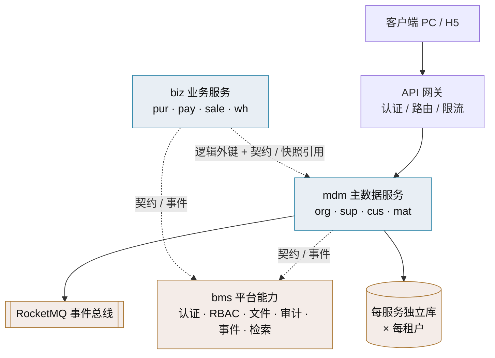

# 架构设计

> mdm 主数据管理 · 总纲

[文档首页](../../文档首页.md) › [mdm 主数据管理规划](../../规划/mdm主数据管理规划.md) › 01_架构设计_总览　|　[概要设计 · 总览 →](../概要设计/01_概要设计_总览.md)

## 1. 文档目的 

本文档是 mdm（主数据管理）架构设计的**总纲**：说明主数据外置与平台接入的总体架构、域服务划分与数据边界，作为概要设计与实现的架构依据。机制复用 bms《架构设计》各子系统节点（认证 / 权限 / 审计 / 事件 / 服务间通信 / 网关等），mdm 不做架构级新决策。

> mdm 以**产品服务（独立服务）**形态接入 BMS 平台（见 bms《平台可扩展性规划》5.2 / 5.7、《微服务演进规划》）：独立仓库、独立部署、每服务独立库，经 OIDC 认证 + 开放接口（`/api/open`）+ 事件复用平台能力。

## 2. 总体架构 

## 3. 域服务划分与数据边界 

| 域服务 | 域简称 | 数据所有权 | 独立库 | 只读出口 |
| --- | --- | --- | --- | --- |
| 组织 | org | 部门 / 岗位 / 用户-岗位关联（org_dept / org_post / org_user_post；关联表 2026-10-03 自 bms 迁入） | mdm 组织库 | 组织数据源 / 名称回显两契约 + 用户-岗位契约 |
| 供应商 | sup | 供应商档案 | mdm 供应商库 | 供应商查询契约 |
| 客户 | cus | 客户档案 | mdm 客户库 | 客户查询契约 |
| 物料 | mat | 物料 / 商品档案 | mdm 物料库 | 物料查询契约 |

- **只读出口**：业务产品（biz 等）跨服务读主数据一律经 mdm **公开契约**或事件，禁止跨库 JOIN（bms《微服务演进规划》S2）。
- **组织主数据只读出口（已迁入 mdm）**：原 bms「跨阶段基座」的**组织主数据查询基座**——`BaseOrgDataSource`（组织数据源：`users` / `posts` / `dept_tree`）与 `BaseOrgNameResolver`（名称回显：`resolve_names`）两契约，随部门/岗位迁出**数据所有权归 mdm 组织域**，由 mdm 实现真实取数。**用户-岗位关联表 `org_user_post` 一并归 mdm 组织域**（原 bms `sys_user_post`，2026-10-03 迁入），mdm 另供**用户-岗位契约**（按用户查岗位 / 全量分配 / 解绑）；bms 不自持岗位关联表。用户删除经 `sys.user.deleted` 事件驱动 mdm 清理。
- **数据引用**：`sys_user.dept_id` 保留在 bms，为对 mdm 部门的逻辑外键；`sys_role_assign`（subject_type = user / post / dept）留 bms（授权归平台权限体系），`subject_id` 引用 mdm id。

## 4. 机制复用（不复制平台设计） 

| 机制 | 依据（bms 架构设计） |
| --- | --- |
| 认证与会话 | 14-认证与会话 |
| 权限计算引擎 | 15-权限计算引擎 |
| 审计哈希链 | 19-审计哈希链 |
| 事件总线 | 16-事件总线 |
| 服务间通信与一致性 | 37-子系统_服务间通信与一致性 |
| API 网关与边缘 | 36-子系统_API网关与边缘 |
| 数据架构 | 07-数据架构 |

> mdm 只做「主数据域」的架构展开，平台机制一律引用 bms 架构设计节点，不重复立法。

## 5. 与上下游文档的关系 

- **上游**：bms《平台可扩展性规划》《微服务演进规划》《项目规划说明》与《架构设计》；产品《mdm 主数据管理规划》。
- **下游**：mdm《概要设计》（各域节点）与《详细设计》（字段级 / 接口 Schema / 页面交互）。
- 接口契约快照（OpenAPI）与概要设计接口清单互为印证，以快照为联调验收依据。

> 架构设计总纲 · 与《mdm 主数据管理规划》及 bms《架构设计》《文档生成规范》《命名规范》配套
