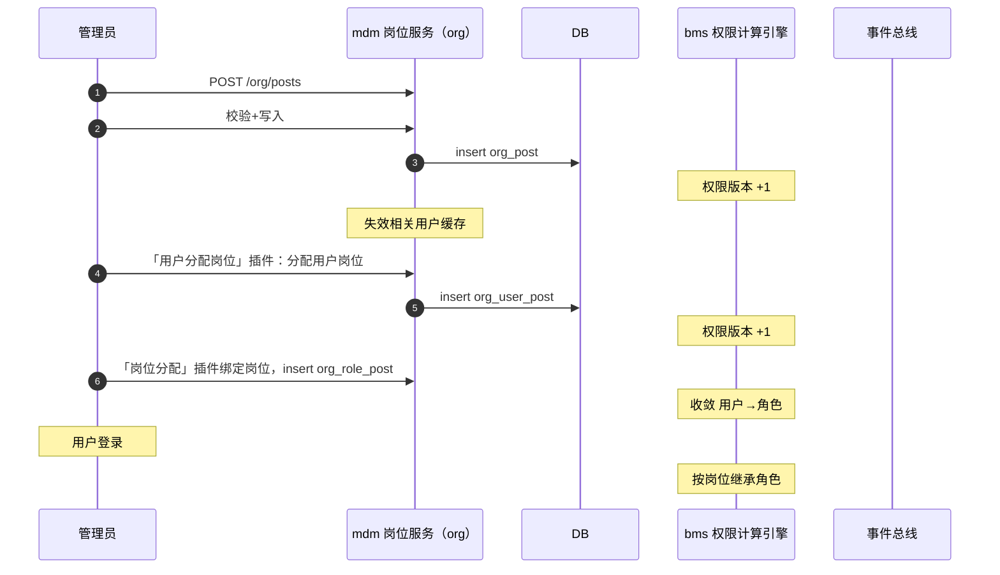

# 概要设计 · 岗位管理

> mdm · 岗位定义（组织域主数据，归属部门）

[概要设计](01_概要设计_总览.md) › 02-岗位管理　|　[← 01-概要设计（总纲）](01_概要设计_总览.md) · [03-部门管理 →](03_概要设计_部门管理.md)

## 1. 模块概述与职责 

> **服务化归口（2026-09-22）**：本项目以微服务为目标架构（平台模块与产品全服务化，见 bms《微服务演进规划》）；本节点在服务化形态下对应**一个服务或服务内能力单元**——拥有独立库（每服务每租户一库）、独立部署与发布，与其他服务经**公开契约或事件**协同（服务边界与一致性见 bms 架构设计 37）。

本节对应《mdm 主数据管理规划》「主数据域全景」之**组织域（org）**的岗位部分，与「标识符登记」（org_post、org_user_post）、架构设计节点 15-权限计算引擎（bms）章节。岗位由原平台组织模块**迁出**，作为 mdm 组织主数据统一维护。

岗位管理负责岗位定义的增删改查（归属部门 `dept_id`、`code / name / sort / status`）、**用户-岗位关联**（`org_user_post`，2026-10-03 自 bms 迁入）与**角色-岗位分配**（`org_role_post`，2026-10-06 归入本域）维护；岗位角色分配数据与契约整体归 mdm 组织域，经「岗位分配」插件在 bms 角色管理页读写（bms 侧 `sys_user_role` 仅承载用户直接分配）。

职责边界：岗位不直接授权，只承载「用户 → 岗位 → 角色」链条的角色绑定关系（收敛由 bms 权限计算引擎处理，岗位侧角色数据由本域经**只读契约**供 bms 汇总）；**用户-岗位关联（分配 / 调岗 / 解绑）与角色-岗位分配均在本域**，分别经**「用户分配岗位」插件**（挂 bms 用户管理页）与**「岗位分配」插件**（挂 bms 角色管理页「角色分配」页签）提供界面与增删改查；bms 不再自持岗位关联表，也不自持角色-岗位表。岗位变更驱动权限计算版本失效，由 bms 权限计算引擎消费。

## 2. 功能分解与业务流程 

### 2.1 功能点分解 

| 功能点 | 说明 | 权限码 |
| --- | --- | --- |
| 岗位列表/详情 | 按部门/状态/关键字筛选，分页或树形视图 | org:query |
| 新建岗位 | 归属部门、code/name、排序、状态 | org:create |
| 修改岗位 | 名称/归属部门/排序/状态调整 | org:update |
| 删除岗位 | 软删除；存在用户或角色绑定时拒绝 | org:delete |
| 用户-岗位分配 | 维护 `org_user_post`（分配 / 调岗 / 解绑，多对多）；经「用户分配岗位」插件在 bms 用户管理页提供 | org:update |
| 岗位下用户查看 | 反查 org_user_post（该岗位在职用户） | org:query |
| 岗位角色分配 | 维护与查看 `org_role_post`（角色 × 岗位，多对多）；经「岗位分配」插件在 bms 角色表单「角色分配」页签读写 | org:update |

### 2.2 业务规则 

- 唯一性：岗位 code 租户内唯一，复合唯一索引 `(code, deleted_at)`；name 可重复但建议唯一
- 岗位归属部门必须存在且启用（部门为 mdm 组织域同域实体 org_dept）；岗位状态 status：enabled/disabled，停用岗位不再参与主体链权限收敛（权限计算过滤）
- 删除约束：岗位仍有关联用户（`org_user_post`）或角色分配（`org_role_post`）时禁止删除，先解绑/调岗
- 岗位变更（增删改/启停）触发权限版本号 +1，相关用户权限缓存即时失效（bms 权限计算引擎）
- 用户-岗位为多对多：一个用户可任多岗，一个岗位可多人任职；删除用户时**经事件**通知 mdm 清理其 org_user_post 记录（跨服务，不跨库写）
- 存储的用户标识：`org_user_post.user_id` 为对 bms 用户（`sys_user.id`）的**逻辑外键**；用户删除经 `sys.user.deleted` 事件驱动的补偿清理，不跨库强约束

### 2.3 流程步骤 

1. **新建岗位**：选择归属部门 → 校验 code 唯一 → 入库（审计字段自动填充）→ 触发权限版本 +1 → 落操作日志与字段级审计
2. **用户分配岗位**（经「用户分配岗位」插件，入口嵌于 bms 用户管理页）：选择用户 → 查询可选岗位 → 写入 org_user_post（联合主键防重）→ 触发权限版本 +1。写操作在 mdm，插件经 mdm 用户-岗位契约执行
3. **删除岗位**：检查关联用户与角色绑定 → 有则拒绝（明确提示）→ 无则软删除 → 版本 +1
4. **异常分支**：停用岗位后其绑定角色仍保留（恢复启用即恢复继承），不自动解绑；code 冲突返回错误码

## 3. 关键时序与协作 

协作要点：角色分配收敛由 bms 权限计算引擎处理——用户直接角色读 bms `sys_user_role`，岗位/部门角色经本域**「按用户解析角色」只读契约**（依 `org_user_post` 与 `org_role_post` / `org_role_dept` 解析）跨服务汇总，取并集去重；岗位启停直接改变收敛结果（版本失效后即时生效）；岗位与角色-岗位变更发布 `org.post.changed` / `org.role_post.changed` 事件（供全文检索索引同步与 bms 权限版本失效；Webhook 默认不订阅）。

## 4. 数据模型与表设计 

### 4.1 核心表 

| 表 | 关键字段 | 说明 |
| --- | --- | --- |
| org_post | code、name、dept_id、sort、status | 岗位主表（mdm 组织库，每租户一库）；归属部门（org_dept.id）；软删除 + 审计字段 + version |
| org_user_post | user_id、post_id | 用户-岗位多对多关联（**2026-10-03 自 bms 迁入**），联合主键；`user_id` 对 bms 用户（sys_user.id）逻辑外键，`post_id` 引用 org_post.id；无软删除，用户删除经 `sys.user.deleted` 事件补偿清理 |
| org_role_post | role_id、post_id | 角色 × 岗位分配（mdm 组织库，**2026-10-06 归入本域**），联合主键；`role_id` 对 bms 角色（sys_role.id）**逻辑外键**，`post_id` 引用 org_post.id；无软删除 |

### 4.2 索引与唯一约束 

- `org_post`：复合唯一索引 `(code, deleted_at)`；索引 dept_id、status、sort
- `org_user_post`：联合主键 (user_id, post_id)；索引 post_id（岗位下用户反查）、user_id（用户下岗位反查）
- `org_role_post`：联合主键 (role_id, post_id)；索引 post_id（岗位下角色反查）、role_id（角色下岗位反查）

### 4.3 数据流转 

- 岗位增删改经 ORM 事件落字段级变更审计（bms sys_data_audit_log，按月分表）
- 岗位软删除数据进回收站（recycle 恢复即清除 deleted_at，恢复动作落审计）；过期残留由 Celery 物理清理
- 岗位数据纳入全文检索主数据索引（经 `org.post.changed` 事件驱动同步）

## 5. 接口设计 

### 5.1 接口清单 

| 方法 | 路径 | 说明 | 权限码 |
| --- | --- | --- | --- |
| GET | /api/v1/org/posts | 岗位列表（page/size；dept_id/status/关键字筛选） | org:query |
| POST | /api/v1/org/posts | 新建岗位 | org:create |
| GET | /api/v1/org/posts/{id} | 岗位详情 | org:query |
| PUT | /api/v1/org/posts/{id} | 修改岗位（version 乐观锁） | org:update |
| DELETE | /api/v1/org/posts/{id} | 删除岗位（有引用拒绝） | org:delete |
| GET | /api/v1/org/posts/{id}/users | 岗位下用户列表 | org:query |
| GET | /api/v1/org/posts/{id}/roles | 岗位角色分配回显 | org:query |
| GET | /api/v1/org/user-posts | 按用户查已分配岗位（供插件与列表回显） | org:query |
| PUT | /api/v1/org/user-posts/{user_id} | 全量覆盖分配用户岗位（插件写入口） | org:update |
| DELETE | /api/v1/org/user-posts/{user_id}/{post_id} | 解绑单个用户-岗位 | org:update |
| GET | /api/v1/org/role-posts | 按角色列已分配岗位（「岗位分配」插件 / 只读回显） | org:query |
| PUT | /api/v1/org/role-posts/{role_id} | 全量覆盖分配角色岗位（「岗位分配」插件写入口） | org:update |
| DELETE | /api/v1/org/role-posts/{role_id}/{post_id} | 解绑单个角色-岗位 | org:update |
| GET | /api/v1/org/user-roles | **按用户解析其经岗位/部门获得的角色**（供 bms 权限引擎跨服务汇总；入参 user_id 与其组织归属） | org:query |

### 5.4 组织域插件（用户分配岗位 / 岗位分配 / 部门分配） 

组织域向 bms 提供三个**具名插槽插件**（见 bms《架构设计 · 扩展点与插件化》「页面区域」扩展点与《前端开发规范》「具名插槽」节）：

**① 用户分配岗位**（挂 bms 用户管理页具名插槽 `sys.user.detail.tabs`）：

- **形态**：运行时模块（Module Federation）或构建期合并包，向插槽注册一个 Tab「用户分配岗位」，内含岗位选择与增删改查界面。
- **数据与写操作**：插件自带取数与写操作，经上述 `/api/v1/org/user-posts` 契约（或 mdm 前端 `api` 能力）执行；**写侧在 mdm**，插件不依赖 bms 岗位表。
- **降级**：插件未注册 / mdm 不可达时，bms 用户管理页**隐藏该 Tab**，页面其余部分正常（不报错、不阻塞）。
- **② 岗位分配**（挂 bms 角色管理页「角色分配」页签具名插槽 `sys.role.detail.assign`，见 bms 概要设计 06-角色管理 / 组件设计-权限配置）：向插槽注册 Tab「岗位分配」，分配/解绑角色岗位，写 mdm `org_role_post`（`/api/v1/org/role-posts`，权限码 `org:update`）；**即时提交**（数据归 mdm，不随 bms 宿主工具栏保存）；当前角色 id 由 bms 基座**显式上下文注入通道**提供（bms 需求 `05-11`）。
- **③ 部门分配**：同 ② 口径，挂同一插槽，写 mdm `org_role_dept`（`/api/v1/org/role-depts`，权限码 `org:update`）；角色-部门分配数据与契约归本域（见《[概要设计 · 部门管理](03_概要设计_部门管理.md)》）。
- **通用化**：同一**具名插槽**机制可挂接同类插件（如以后字典主数据、业务表单提供的用户扩展 Tab），插件各自提供界面与增删改查触发接口。

> **平台侧前置契约已交付（2026-10-03）**：bms 阶段五域 06 子任务 `06_01`（需求 05-10「具名插槽基座功能与前后端配套插件」）已交付**具名插槽基座与前后端配套约定**——区域项声明字段（插槽键 / 次序 / 展示名 / 图标 / 权限码与判定模式 / 显示条件）、区域插槽件 `inline` / `tabs` 两形态、宿主页上下文来源约定（宿主页作用实体标识放**路由参数**，插件经**注入的 `router` 只读**读取）与降级口径（未注册 / 不可达 / 权限不满足即该项不渲染）；平台内样例插件 `slot-sample` 已按该约定真跑通全链路（平台侧说明见 bms《项目/05_前端插件化》域 06 的详细设计、实施记录与测试记录）。本插件实现口径对齐该约定：**前端模块**向 `sys.user.detail.tabs` 注册区域项（含 `order` / `title` / `perm: 'org:update'`），**后端契约**归 mdm（本节 `/api/v1/org/user-posts`，权限码 `org:update`）；区域件经宿主注入 `api` 能力调用，不自建 HTTP。**（2026-10-06 补充）**：角色表单「角色分配」页签为**非路由页面**（表单框架记录 Tab），其插件上下文依赖 bms 基座**「显式上下文注入通道」**（bms 需求 `05-11`，另立项）——该通道就绪前，「岗位分配 / 部门分配」插件按降级（隐藏）推进。

### 5.2 分页/幂等/限流 

- 列表分页 `page/size`，响应 `{list, total, page, size}`；岗位量级小，可另供全量下拉选项接口（不分页）
- 写接口支持 `Idempotency-Key` 幂等（Redis SETNX 前置拦截 + 唯一约束兜底）
- 限流：岗位写操作按用户维度叠加 slowapi 限制；查询走常规限流

### 5.3 事件发布 

| 事件 | 触发时机 | 主要载荷 | Webhook 订阅 |
| --- | --- | --- | --- |
| org.post.changed | 岗位增删改/启停 | post_id、dept_id、status | 否 |
| org.user_post.changed | 用户-岗位分配/解绑 | user_id、post_ids | 否 |
| org.role_post.changed | 角色-岗位分配/解绑 | role_id、post_ids | 否 |

> 角色-岗位分配记录（org_role_post）变更落本域字段级审计，并经 `org.role_post.changed` 事件驱动 bms 权限版本失效；用户-角色分配（sys_user_role）留 bms 落字段级审计。用户删除经 `sys.user.deleted`（bms 发布）驱动本域清理 org_user_post 与 org_role_post（按岗位反查，如有）。

## 6. 权限与配置 

### 6.1 权限码 

本模块对应 `org` 组织域业务（默认归属系统管理员），动作：`org:query`（查询）、`org:create`（新建）、`org:update`（修改/启停）、`org:delete`（删除）。部门与岗位共用组织域级权限码。**角色-岗位分配**与**用户-岗位分配**操作使用 `org:update`（本域，经插件）；bms 角色管理侧的用户分配使用 `role:grant`（安全管理员）。

### 6.2 菜单挂接 

- 菜单「岗位管理」（form=post_form，挂 org 业务），置于系统管理菜单组
- 按钮挂接：新增/编辑/删除（create/update/delete）按角色授予后显隐；详情按钮（query）
- 三权分立：org 组织域业务归属系统管理员角色，安全管理员可查看（由角色授权决定），不互斥冲突

### 6.3 sys_config 参数 

| 参数 | 默认 | 说明 |
| --- | --- | --- |
| org.post_code_pattern | ^[a-z][a-z0-9_-]{1,31}$ | 岗位 code 格式约束 |
| org.post_max_per_user | 10 | 单用户可任岗位数上限（防滥用） |

### 6.4 种子数据 

- 平台库种子：org 业务码与动作码（query/create/update/delete）、岗位管理菜单/表单/按钮/字段挂接与 i18n 文案
- 租户开通种子：无预置岗位（由系统管理员按组织创建）；不预置岗位角色绑定

## 7. 错误码与异常处理 

本模块错误码段 **mdm 组织域 33xxxx**（原平台 3xxxx 已迁出），文案由前端按 i18n 映射。

| 错误码 | 说明 |
| --- | --- |
| 330031 | 岗位不存在 |
| 330032 | 岗位 code 已存在 |
| 330033 | 归属部门不存在或已停用 |
| 330034 | 岗位仍关联用户，禁止删除 |
| 330035 | 岗位仍绑定角色，禁止删除（需先解绑） |
| 330036 | 岗位 code 不符合格式约束 |

异常处理要求：删除前引用检查与删除在同一事务内（防并发插入引用）；并发删除用 version 乐观锁拒绝；岗位变更导致权限计算的版本递增操作失败时，回滚业务写入（一致性优先）。

## 8. 页面清单与验收要点 

### 8.1 页面清单 

| 页面 | 端 | 说明 |
| --- | --- | --- |
| 岗位管理 | PC | 岗位列表（按部门筛选）、新建/编辑/删除、启停、岗位下用户/角色分配查看 |
| 用户分配岗位（插件） | PC | 挂 bms 用户管理页具名插槽 `sys.user.detail.tabs` 的 Tab，分配/调岗/解绑用户岗位 |
| 岗位分配 / 部门分配（插件） | PC | 挂 bms 角色管理页「角色分配」页签具名插槽 `sys.role.detail.assign` 的 Tab，分配/解绑角色岗位（`org_role_post`）与角色部门（`org_role_dept`）；依赖 bms 基座显式上下文注入通道（`05-11`） |

### 8.2 验收标准 

- 岗位 CRUD 全链路可用；code 唯一与格式校验生效；软删除后回收站可恢复
- 「用户分配岗位」插件在 bms 用户管理页正常渲染与增删改查（写侧落 mdm org_user_post）；「岗位分配 / 部门分配」插件在 bms 角色管理页「角色分配」页签正常渲染（写侧落 mdm org_role_post / org_role_dept）；插件缺失时对应 Tab 隐藏、页面其余正常
- 用户分配岗位后，权限计算按「用户→岗位→角色」收敛正确（经 `/api/v1/org/user-roles` 只读契约汇总），多岗取并集去重验证通过
- 岗位分配角色后，经 `/api/v1/org/user-roles` 汇入 bms 权限引擎的岗位角色正确；解绑即时失效（权限版本 +1）
- 停用岗位后相关用户继承权限即时失效（权限版本 +1）；重新启用即恢复
- 删除约束验证：有关联用户/角色分配的岗位拒绝删除并给出明确提示
- `org.post.changed` / `org.user_post.changed` / `org.role_post.changed` 事件发布与消费验证通过；字段级审计与操作日志落库，哈希链校验通过

> 概要设计节点 · 与《mdm 主数据管理规划》及 bms《架构设计》《文档生成规范》《命名规范》配套
