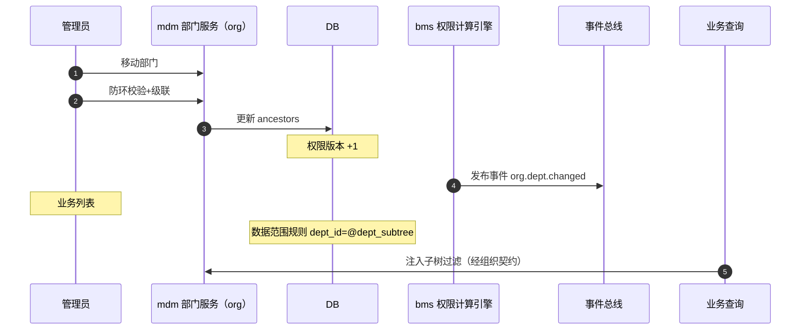

# 概要设计 · 部门管理

> mdm · 组织架构树（组织域主数据，数据权限依据）

[概要设计](01_概要设计_总览.md) › 03-部门管理　|　[← 02-岗位管理](02_概要设计_岗位管理.md) · [04-供应商 →](04_概要设计_供应商.md)

## 1. 模块概述与职责 

> **服务化归口（2026-09-22）**：本项目以微服务为目标架构（平台模块与产品全服务化，见 bms《微服务演进规划》）；本节点在服务化形态下对应**一个服务或服务内能力单元**——拥有独立库（每服务每租户一库）、独立部署与发布，与其他服务经**公开契约或事件**协同（服务边界与一致性见 bms 架构设计 37）。

本节对应《mdm 主数据管理规划》「主数据域全景」之**组织域（org）**的部门部分，与「标识符登记」（org_dept）、架构设计节点 15-权限计算引擎（bms）章节。部门由原平台组织模块**迁出**，作为 mdm 组织主数据统一维护。

部门管理维护组织架构树（`parent_id / ancestors / name / sort / status`），用户归属部门经 bms `sys_user.dept_id` **逻辑外键**引用（bms 保留字段）；部门作为角色分配主体之一（mdm **`org_role_dept`**，角色 × 部门；2026-10-06 归入本域，经「部门分配」插件在 bms 角色管理页读写），并作为动作级数据范围的部门维度依据（数据权限规则引用部门维度，如 dept_id = @current_dept）。

职责边界：部门不直接授权；「用户→部门→角色」收敛由 bms 权限计算引擎经本域**「按用户解析角色」只读契约**处理；数据范围规则配置在 bms 角色管理（role:grant），本模块提供部门数据支撑；**角色-部门分配（`org_role_dept`）在本域**，经「部门分配」插件呈现与维护（见《[概要设计 · 岗位管理](02_概要设计_岗位管理.md)》§5.4）。部门变更发布 `org.dept.changed` 事件（不订阅 Webhook）。部门主数据**只读出口**（组织数据源 / 名称回显两契约）由本域实现，供 bms 与业务产品消费。

## 2. 功能分解与业务流程 

### 2.1 功能点分解 

| 功能点 | 说明 | 权限码 |
| --- | --- | --- |
| 部门树/详情 | 组织架构树（含状态/排序），节点详情与路径（ancestors）展示 | org:query |
| 新建部门 | 选择父部门（根部门默认存在）、name/sort/status | org:create |
| 修改部门 | 名称/排序/状态调整 | org:update |
| 移动部门 | 调整父部门，级联维护子树 ancestors | org:update |
| 删除部门 | 存在子部门或归属用户/岗位时拒绝；软删除 | org:delete |
| 部门用户查看 | 按部门（含子树）查看归属用户（经 bms 用户数据协同） | org:query |
| 部门角色分配 | 维护与查看 `org_role_dept`（角色 × 部门）；经「部门分配」插件在 bms 角色分配页签读写 | org:update |

### 2.2 业务规则 

- 树结构：parent_id 指向父部门（org_dept 自引用），根部门 parent_id 为空；ancestors 存储祖先 id 路径（如 /1/5/9/），用于子树查询与数据权限下钻
- 部门移动：校验新父部门不能是自身或其后代（防环）；移动后级联更新子树全部 ancestors 并发布 org.dept.changed
- 删除约束：存在子部门、归属用户（bms sys_user.dept_id 逻辑外键）或岗位（org_post.dept_id）引用时禁止删除；停用部门不参与角色分配收敛与数据范围匹配
- 角色分配：部门可分配角色（mdm `org_role_dept`，角色 × 部门），收敛为「用户→部门→角色」（经本域只读契约汇入 bms 权限引擎）；部门变更触发权限版本 +1
- 数据权限依据：动作级数据范围规则（bms sys_data_scope）可引用部门维度预置变量（如 @current_dept、@dept_subtree），解析结果强制叠加租户过滤
- 部门停用：其下用户仍可登录但失去部门继承的角色权限；恢复启用后权限即时恢复

### 2.3 流程步骤 

1. **新建部门**：选择父部门 → 生成 ancestors（父 ancestors + 父 id）→ 入库 → 权限版本 +1（若涉及角色绑定）→ 落审计
2. **移动部门**：校验防环 → 更新节点 parent_id/ancestors → 级联更新子树 ancestors（单事务）→ 发布 `org.dept.changed` → 权限版本 +1
3. **删除部门**：引用检查（子部门/用户/岗位/角色分配）→ 无引用则软删除 → 发布 org.dept.changed
4. **异常分支**：防环校验失败拒绝移动；存在引用拒绝删除（明确提示引用对象）；并发移动用 version 乐观锁

## 3. 关键时序与协作 

协作要点：数据范围规则按部门维度下钻（@dept_subtree 展开为子树 id 集合注入查询）；部门角色分配（`org_role_dept`）经本域「按用户解析角色」只读契约汇入 bms 权限引擎，其变更经 `org.role_dept.changed` 事件触发 bms 权限版本失效；org.dept.changed 事件供全文检索索引同步等消费（Webhook 不可订阅）。

## 4. 数据模型与表设计 

### 4.1 核心表 

| 表 | 关键字段 | 说明 |
| --- | --- | --- |
| org_dept | parent_id、ancestors、name、sort、status | 部门树（mdm 组织库，每租户一库）；可分配角色（`org_role_dept`），数据权限依据；软删除 + 审计字段 + version |
| sys_user（bms，引用） | dept_id | 用户归属部门（逻辑外键引用 org_dept.id），**留 bms** |
| org_post（引用） | dept_id | 岗位归属部门（同域） |
| org_user_post（引用） | user_id、post_id | 用户-岗位关联（mdm 组织域，2026-10-03 自 bms 迁入） |
| org_role_dept | role_id、dept_id | 角色 × 部门分配（mdm 组织库，**2026-10-06 归入本域**），联合主键；`role_id` 对 bms 角色（sys_role.id）**逻辑外键**，`dept_id` 引用 org_dept.id；无软删除 |
| sys_data_scope（bms，引用） | action_id、config | 动作级数据范围规则可引用部门维度（预置变量） |

### 4.2 索引与唯一约束 

- `org_dept`：索引 parent_id、status、sort；ancestors 前缀索引支撑子树查询与 @dept_subtree 展开
- `sys_user`：索引 dept_id（部门用户查询、数据范围过滤字段强制建索引）
- `org_role_dept`：联合主键 (role_id, dept_id)；索引 dept_id、role_id
- `sys_data_scope`：action_id 唯一；规则引用的部门字段须为已索引字段（性能约束）

### 4.3 数据流转 

- 部门增删改/移动经 ORM 事件落字段级变更审计（bms sys_data_audit_log，按月分表，ancestors 变更亦记录）
- org.dept.changed 事件：驱动全文检索主数据索引同步、数据范围缓存失效
- 部门软删除进回收站（recycle 恢复）；恢复时若父部门已删除则挂回原父或根节点（按回收语义处理）
- 过期软删除残留由 Celery 定时物理清理（与归档清理任务衔接）

## 5. 接口设计 

### 5.1 接口清单 

| 方法 | 路径 | 说明 | 权限码 |
| --- | --- | --- | --- |
| GET | /api/v1/org/depts | 部门树（含 status/sort 过滤） | org:query |
| POST | /api/v1/org/depts | 新建部门（parent_id/name/sort） | org:create |
| GET | /api/v1/org/depts/{id} | 部门详情（含 ancestors 路径） | org:query |
| PUT | /api/v1/org/depts/{id} | 修改部门（名称/排序/状态） | org:update |
| PUT | /api/v1/org/depts/{id}/move | 移动部门（新 parent_id，级联维护 ancestors） | org:update |
| DELETE | /api/v1/org/depts/{id} | 删除部门（有引用拒绝） | org:delete |
| GET | /api/v1/org/depts/{id}/users | 部门（含子树）归属用户列表 | org:query |
| GET | /api/v1/org/depts/{id}/roles | 部门角色分配回显 | org:query |
| GET | /api/v1/org/role-depts | 按角色列已分配部门（「部门分配」插件 / 只读回显） | org:query |
| PUT | /api/v1/org/role-depts/{role_id} | 全量覆盖分配角色部门（「部门分配」插件写入口） | org:update |
| DELETE | /api/v1/org/role-depts/{role_id}/{dept_id} | 解绑单个角色-部门 | org:update |

> **组织主数据只读出口（两契约）**：另供组织数据源（`users` / `posts` / `dept_tree`）与名称回显（`resolve_names`）两个只读契约，供 bms 与业务产品消费——出口路径 `/api/v1/org/data-source/{users,posts,dept-tree}` 与 `/api/v1/org/resolve-names`（对外 `/api/mdm/v1/org/...`），鉴权 `require_auth`（用户）+ `require_service`（服务间白名单），数据范围与脱敏实现侧强制接入；原 bms 跨阶段基座组织主数据查询契约迁入本域（见《[架构设计 · 总览](../架构设计/01_架构设计_总览.md)》3 节与 5.1 表内上方注块）。
>
> **原型依据**：[部门管理原型](../原型设计/03_部门管理/01_设计说明.html)（部门管理页 / 部门表单页；可交互原型即验收基准，2026-10-07 随组织主数据承接自 bms 迁入本仓库并按模块拆分）。

### 5.2 分页/幂等/限流 

- 部门树量级小：树形返回不分页；部门用户列表分页 `page/size`，响应 `{list, total, page, size}`
- 移动/新建/删除等写接口支持 `Idempotency-Key` 幂等；移动操作为单事务（节点 + 子树级联）
- 限流：部门写操作按用户维度叠加 slowapi 限制；查询走常规限流

### 5.3 事件发布 

| 事件 | 触发时机 | 主要载荷 | Webhook 订阅 |
| --- | --- | --- | --- |
| org.dept.changed | 部门增删改/移动 | dept_id、parent_id | 否 |
| org.role_dept.changed | 角色-部门分配/解绑 | role_id、dept_ids | 否 |

## 6. 权限与配置 

### 6.1 权限码 

本模块对应 `org` 组织域业务（默认归属系统管理员），动作：`org:query`（查询）、`org:create`（新建）、`org:update`（修改/移动/启停）、`org:delete`（删除）。部门与岗位共用组织域级权限码。**角色-部门分配**操作使用 `org:update`（本域，经「部门分配」插件）；bms 角色管理侧的用户分配使用 `role:grant`。

### 6.2 菜单挂接 

- 菜单「部门管理」（form=dept_form，挂 org 业务），置于系统管理菜单组
- 按钮挂接：新增/编辑/删除/移动（create/update/delete）按角色授予后显隐；部门树默认 query 可见
- 部门树被多表单引用（用户管理选择归属部门、数据范围配置选择部门）——引用方按各自权限码校验

### 6.3 sys_config 参数 

| 参数 | 默认 | 说明 |
| --- | --- | --- |
| org.dept_tree_max_depth | 10 | 部门树最大深度（防无限层级） |
| org.dept_max_children | 500 | 单节点直接子部门数上限 |
| org.dept_scope_subtree_enabled | true | 数据范围规则是否允许 @dept_subtree 下钻 |

### 6.4 种子数据 

- 平台库种子：org 业务码与动作码（query/create/update/delete）、部门管理菜单/表单/按钮/字段挂接与 i18n 文案
- 租户开通种子：根部门（如「总公司」）自动创建，ancestors=/根id/；系统管理员账号归属根部门（bms sys_user.dept_id 引用）

## 7. 错误码与异常处理 

本模块错误码段 **mdm 组织域 33xxxx**（原平台 3xxxx 已迁出），文案由前端按 i18n 映射。

| 错误码 | 说明 |
| --- | --- |
| 330051 | 部门不存在 |
| 330052 | 父部门不存在或已停用 |
| 330053 | 移动形成环：父部门不能是自身或其后代 |
| 330054 | 部门仍存在子部门，禁止删除 |
| 330055 | 部门仍被用户/岗位引用，禁止删除 |
| 330056 | 部门仍存在角色分配，禁止删除（需先解绑） |
| 330057 | 部门树深度超出上限 |

异常处理要求：移动操作级联更新与校验同事务，失败整体回滚（防半棵树）；并发移动/删除用 version 乐观锁；停用部门不影响历史数据引用（仅退出权限收敛与范围匹配）；org.dept.changed 发布失败不影响主事务（事件总线重试）。

## 8. 页面清单与验收要点 

### 8.1 页面清单 

| 页面 | 端 | 说明 |
| --- | --- | --- |
| 部门管理 | PC | 组织架构树、新建/编辑/删除/移动、部门用户查看、部门角色分配查看 |
| 部门分配（插件） | PC | 挂 bms 角色管理页「角色分配」页签具名插槽 `sys.role.detail.assign` 的 Tab，分配/解绑角色部门（`org_role_dept`）；依赖 bms 基座显式上下文注入通道（`05-11`） |

### 8.2 验收标准 

- 部门树增删改/移动全链路可用；移动后子树 ancestors 级联正确（含二次移动验证）
- 防环校验生效：将父部门移入其子树被拒绝；删除有引用的部门被拒绝并给出明确提示
- 「用户→部门→角色」收敛权限计算正确（经 `/api/v1/org/user-roles` 只读契约汇入 bms 权限引擎）；停用部门后继承权限即时失效、恢复即生效；「部门分配」插件缺失时该 Tab 隐藏、页面其余正常
- 数据范围规则按部门维度（含子树下钻）读时过滤/写时校验双向生效
- `org.dept.changed` 事件发布与消费验证通过；字段级审计与哈希链校验通过

> 概要设计节点 · 与《mdm 主数据管理规划》及 bms《架构设计》《文档生成规范》《命名规范》配套
