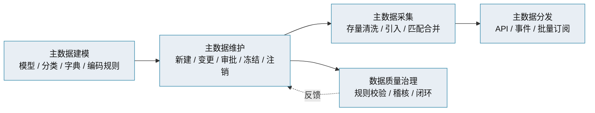
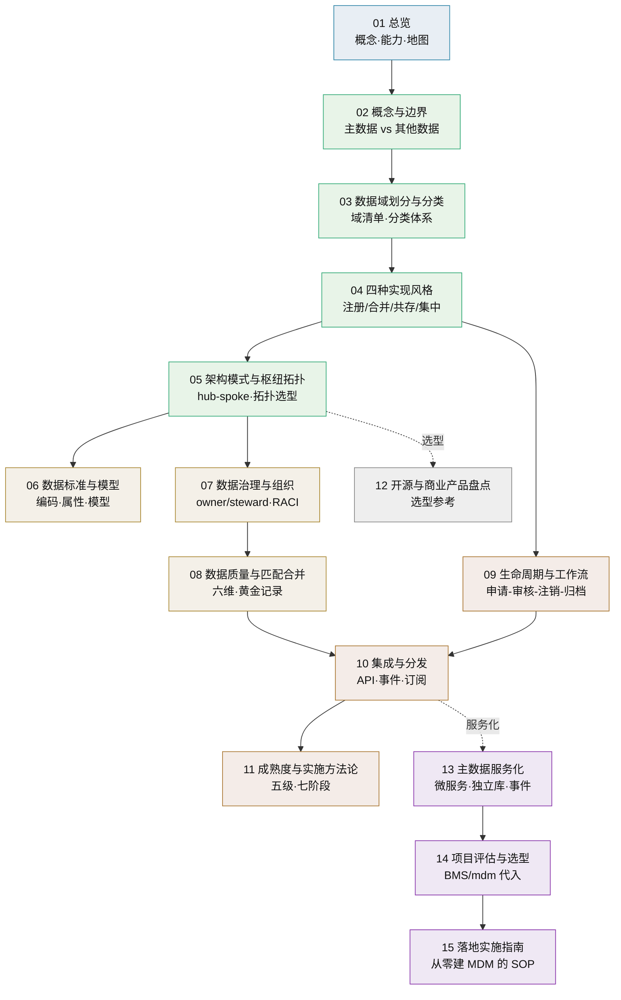

# 主数据管理总览

> 主数据管理（MDM）是什么 · 核心能力 · 四种实现风格 · 子篇地图

[文档首页](../../../文档首页.md) › [知识档案](../mdm知识档案总览.md) › 主数据管理总览　|　[← 返回总览](../mdm知识档案总览.md)

---

## 1. 概述与定位 

**主数据管理（Master Data Management，简称 MDM）**是一套制度与技术相结合的方法：把企业里那些**被多个业务部门 / 多个系统共同引用、且引用必须保持一致**的核心实体档案（客户、产品、供应商、组织、员工、位置等）收敛为**统一的权威源**，通过标准、流程、治理与技术平台保证其准确、完整、唯一、及时，并以服务方式分发给各业务系统。

一句话：**主数据管理的目标，是让企业内「同一个实体」在各系统里只有一个可信版本（黄金记录 / Golden Record），而不是各系统各存一份、口径不一、彼此对不上。**

> 本目录是**知识档案**（辅助参考），回答「主数据管理有哪些标准做法、各有什么取舍」；本项目的具体定位、域划分与平台接入属《[mdm 主数据管理规划](../../../规划/mdm主数据管理规划.md)》与设计文档范畴，本目录只做知识铺垫，不替代规划与设计。

## 2. 为什么需要主数据管理 

没有主数据管理时，企业数据呈现「四不」——**不统一、不准确、不可信、不可复用**，典型症状：

| 症状 | 后果 |
| --- | --- |
| 同一客户/供应商/物料在多个系统各存一份、编码不同 | 跨系统对账困难、报表口径打架，需人工翻译编码 |
| 各部门自行维护基础数据，无统一标准 | 同一实体多条记录、重复建档、字段口径不一致 |
| 数据质量无稽核、错误层层扩散 | 发票寄错地址、采购下错物料、决策基于脏数据 |
| 无权威出口、无变更分发机制 | 上游改了基础数据，下游系统不知道，长期漂移 |
| 无审计、无生命周期管理 | 历史数据查不到、失效数据仍被引用、合规风险 |

主数据管理解决的正是**共享数据的唯一可信问题**：统一标准（口径一致）→ 统一维护（单一入口）→ 统一出口（服务化分发）→ 持续治理（质量闭环）。

## 3. 核心能力与概念 

主数据管理平台的标准能力通常围绕「**建模—维护—采集—分发—治理**」五大块展开：

核心术语：

| 术语 | 定义 | 对应篇目 |
| --- | --- | --- |
| 主数据（Master Data） | 跨业务共享、稳定、权威的核心实体档案 | [02 概念与边界](02_主数据管理_概念与边界.md) |
| 主数据域（Data Domain） | 一类主数据的集合，如客户域、物料域 | [03 数据域划分与分类](03_主数据管理_数据域划分与分类.md) |
| 黄金记录（Golden Record） | 匹配合并后形成的单一可信记录 | [08 数据质量与匹配合并](08_主数据管理_数据质量与匹配合并.md) |
| 数据标准（Data Standard） | 编码规则、属性规范、分类体系、模型 | [06 数据标准与数据模型](06_主数据管理_数据标准与数据模型.md) |
| 数据治理（Data Governance） | 政策、组织、流程与责任体系 | [07 数据治理与组织](07_主数据管理_数据治理与组织.md) |
| 数据管家（Data Steward） | 日常执行治理、维护质量的责任角色 | [07 数据治理与组织](07_主数据管理_数据治理与组织.md) |
| 生命周期（Lifecycle） | 从申请、创建到冻结、注销、归档的全过程 | [09 生命周期与工作流](09_主数据管理_生命周期与工作流.md) |
| 数据分发（Distribution） | 把主数据同步到下游消费方 | [10 集成与分发](10_主数据管理_集成与分发.md) |
| 实现风格（Implementation Style） | 注册 / 合并 / 共存 / 集中四种落地形态 | [04 四种实现风格](04_主数据管理_四种实现风格.md) |
| 成熟度（Maturity） | 主数据管理能力的阶段性水平（五级） | [11 成熟度与实施方法论](11_主数据管理_成熟度与实施方法论.md) |

## 4. 子篇地图 

| 篇目 | 回答的问题 | 适用阶段 |
| --- | --- | --- |
| [01 总览](01_主数据管理_总览.md) | 主数据管理是什么、能力全景、分几块看 | 通读 |
| [02 概念与边界](02_主数据管理_概念与边界.md) | 什么样的数据算主数据、和交易/参考/元数据怎么区分 | 通读 |
| [03 数据域划分与分类](03_主数据管理_数据域划分与分类.md) | 主数据分哪些域、怎么分类与划界 | 规划期 |
| [04 四种实现风格](04_主数据管理_四种实现风格.md) | 注册 / 合并 / 共存 / 集中四种风格怎么选 | 规划期 |
| [05 架构模式与枢纽拓扑](05_主数据管理_架构模式与枢纽拓扑.md) | 主数据枢纽如何与源系统、消费方组网 | 架构期 |
| [06 数据标准与数据模型](06_主数据管理_数据标准与数据模型.md) | 编码规则、属性规范、模型怎么定 | 设计期 |
| [07 数据治理与组织](07_主数据管理_数据治理与组织.md) | 谁负责、谁执行、流程与责任怎么落 | 全程 |
| [08 数据质量与匹配合并](08_主数据管理_数据质量与匹配合并.md) | 数据质量怎么衡量、重复怎么合并成黄金记录 | 设计期 |
| [09 生命周期与工作流](09_主数据管理_生命周期与工作流.md) | 申请、审核、变更、冻结、注销、归档怎么走 | 设计期 |
| [10 集成与分发](10_主数据管理_集成与分发.md) | 主数据怎么集成与分发给下游 | 设计期 |
| [11 成熟度与实施方法论](11_主数据管理_成熟度与实施方法论.md) | 分几步走、成熟度怎么评估 | 规划期 |
| [12 开源与商业产品盘点](12_主数据管理_开源与商业产品盘点.md) | 市面有哪些产品、自建还是采购 | 选型期 |
| [13 主数据服务化](13_主数据管理_主数据服务化.md) | 主数据如何做成独立服务、与微服务一致 | 架构期 |
| [14 项目评估与选型](14_主数据管理_项目评估与选型.md) | 标准做法如何落到 BMS / mdm 本项目 | 规划期 |
| [15 落地实施指南](15_主数据管理_落地实施指南.md) | 从零建一个主数据域的 SOP 与检查清单 | 动手时 |
| [16 组织主数据承接跨仓部署联调清单](16_主数据管理_组织主数据承接跨仓部署联调清单.md) | 可执行 runbook：mdm 出口 ↔ bms 网关 / 前端 ↔ 联合验收（逐步命令 + 证据落点 + 回滚） | 部署联调时 |

## 5. 四种实现风格一句话速记 

| 风格 | 谁说了算（Source of Record） | 数据往哪走 | 适用 |
| --- | --- | --- | --- |
| 注册（Registry） | 源系统 | 枢纽只存索引与映射，不存明细 | 起步、低治理成熟度、多源只读 |
| 合并（Consolidation） | 源系统写、枢纽读 | 汇总进枢纽形成黄金记录，**不回写** | 分析、报表、合规 |
| 共存（Coexistence） | 枢纽与源系统并存 | 枢纽是权威源之一，**双向同步**回源 | 存量系统不可下线、需统一 |
| 集中（Centralized） | 枢纽唯一 | 只在枢纽创建，下游只订阅 | 新建体系、最强管控 |

> 详细对比与选择决策见《[04 四种实现风格](04_主数据管理_四种实现风格.md)》；多数企业**从注册/合并起步，随治理成熟走向共存/集中**。

## 6. 与本项目的关联（简述） 

- 本项目已把**组织 / 供应商 / 客户 / 物料**等跨业务共享实体归为 mdm 主数据域，以**产品服务（独立服务）**形态接入 BMS 平台、**每服务独立库**、经**契约 / 事件**对外（见《[mdm 主数据管理规划](../../../规划/mdm主数据管理规划.md)》《[架构设计 · 总览](../../../设计/架构设计/01_架构设计_总览.md)》）。
- 从四种实现风格看，本项目属**集中式（Centralized）**——mdm 是主数据唯一创建方与权威出口，业务产品只引用（逻辑外键 + 快照）不建档。
- 标准做法到本项目的完整映射见《[14 项目评估与选型](14_主数据管理_项目评估与选型.md)》；动手清单见《[15 落地实施指南](15_主数据管理_落地实施指南.md)》。

## 7. 常见误区 

- **把主数据管理等同于建一个库或买一套软件**：制度、流程与标准占成败的大头，工具只是载体（「组织 + 流程 + 标准 80% 决定成败」）。
- **一次性把所有主数据都管起来**：范围过大、周期过长，应按优先级**分批建设**，先出阶段性效果。
- **重采集轻治理**：存量清洗上线后就不管，半年一年后数据质量「回到解放前」——必须有持续运营与稽核闭环。
- **枢纽无权威、或权威多头**：源系统与枢纽同时可写又不同步，必然漂移；写侧唯一归属是底线。
- **把主数据当交易数据管**：主数据关注「当前最新可信版本」，不承载单据流转与历史流水。

## 8. 学习与参考资料 

| 资源 | 网址 | 说明 |
| --- | --- | --- |
| IBM：什么是主数据管理（MDM） | https://www.ibm.com/cn-zh/think/topics/master-data-management | 定义、六类数据、主数据域、工具能力，中文综述 |
| Gartner：Master Data Management | https://www.gartner.com/en/data-analytics/topics/master-data-management | 成熟度五级、路线图与治理框架 |
| Gartner：MDM 解决方案市场 | https://www.gartner.com/reviews/market/master-data-management-solutions | 必备能力（黄金记录、数据治理与管家） |
| Profisee：MDM Implementation Styles | https://profisee.com/blog/master-data-management-implementation-styles/ | 四种实现风格详解 |
| Stibo Systems：MDM implementation styles | https://www.stibosystems.com/blog/4-common-master-data-management-implementation-styles | 四风格对比与示意 |
| Informatica：MDM Implementation Guide | https://www.informatica.com/resources/articles/mdm-implementation.html | 风格选择决策框架、实施步骤 |
| Oracle：什么是 MDM | https://www.oracle.com/cn/scm/product-lifecycle-management/master-data-management/ | MDM 与 PIM、企业主数据概念 |

## 9. 项目内关联文档 

| 文档 | 说明 |
| --- | --- |
| 《[mdm 知识档案总览](../mdm知识档案总览.md)》 | mdm 知识档案入口索引 |
| 《[mdm 主数据管理规划](../../../规划/mdm主数据管理规划.md)》 | 产品定位、主数据域全景、平台复用边界、标识符登记 |
| 《[架构设计 · 总览](../../../设计/架构设计/01_架构设计_总览.md)》 | 主数据外置与平台接入架构、域服务划分 |
| 《[概要设计 · 总览](../../../设计/概要设计/01_概要设计_总览.md)》 | 组织 / 供应商 / 客户 / 物料主数据模块设计 |
| 《[14 项目评估与选型](14_主数据管理_项目评估与选型.md)》 | 标准做法到 BMS / mdm 的映射与选型 |

---

> 依《[文档生成规范](../../../../bms文档/规范/文档生成规范.md)》编写
