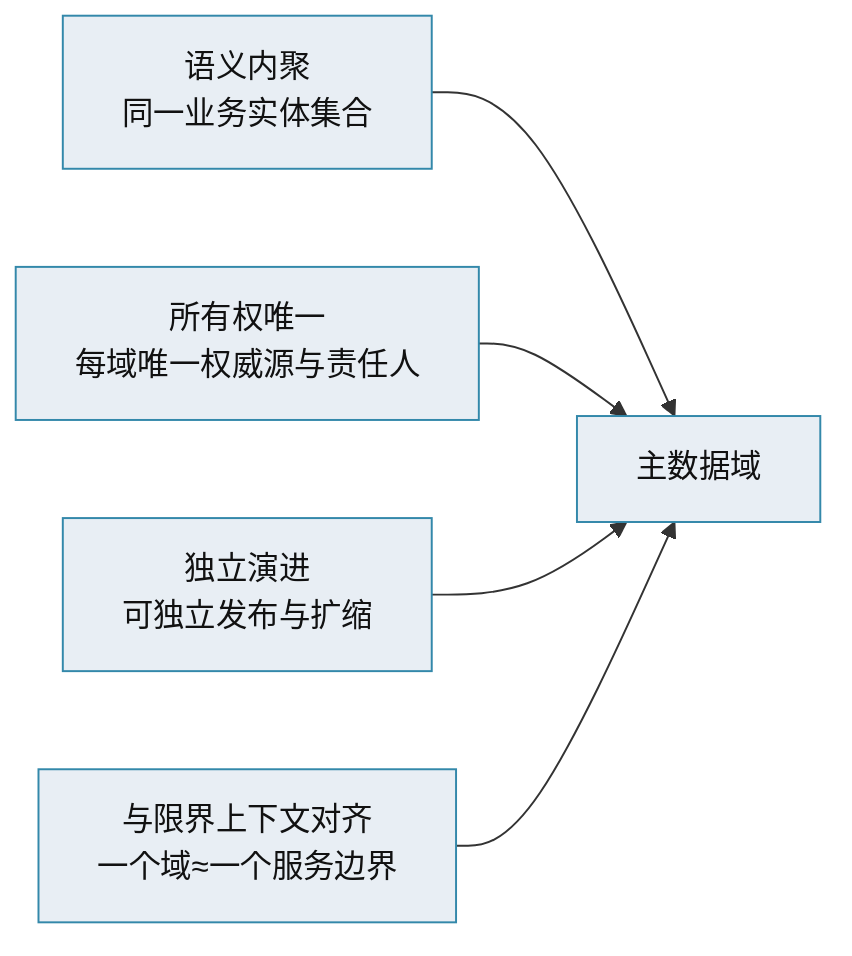

# 主数据管理 · 数据域划分与分类

> 主数据域怎么划 · 分类体系与层级 · 域与限界上下文 · 划界原则

[文档首页](../../../文档首页.md) › [知识档案](../mdm知识档案总览.md) › [主数据管理](01_主数据管理_总览.md) › 数据域划分与分类　|　[← 返回总览](01_主数据管理_总览.md)

---

## 1. 概述 

**主数据域（Master Data Domain）**是一类语义内聚、可独立治理的主数据集合（如客户域、物料域）。域划得好，各域独立演进、边界清晰；划得不好，要么职责重叠反复扯皮，要么牵一发动全身。本篇讲域划分与域内分类两条主线。

## 2. 域划分的四条原则 

| 原则 | 说明 |
| --- | --- |
| 语义内聚 | 一个域内的实体语义相关（如「部门 + 岗位」同属组织上下文） |
| 所有权唯一 | 每个域只有**一个权威源、一个数据责任人**，禁止多头可写 |
| 独立演进 | 域之间松耦合，可独立建模、独立发布、独立扩缩容 |
| 与限界上下文对齐 | 域边界尽量与领域驱动设计（DDD）的限界上下文一致，便于按域拆服务、每域独立库 |

> **域 ≠ 库 ≠ 服务**：一个域通常对应一个服务/库更清晰；但小域也可合并承载，大域可再分子域。关键看**所有权与变更频率**是否一致。

## 3. 域内分层：主题域 / 子域 / 实体 

一个主数据域内部通常再分层：

| 层 | 说明 | 示例（组织域） |
| --- | --- | --- |
| 主题域（Subject Area） | 高层次的业务主题分组 | 组织与人员 |
| 主数据域（Domain） | 一类实体的集合 | 组织 |
| 子域（Sub-domain） | 域内可独立管理的分支 | 部门、岗位 |
| 实体（Entity） | 具体主数据对象 | 部门记录、岗位记录 |
| 属性（Attribute） | 实体的字段 | 部门名称、上级部门、负责人 |

> 子域之间的关联（如「岗位归属部门」「用户-岗位关联」）是**域内关系**，随域一并管理；跨域关系用**逻辑外键 + 契约**，不建物理外键、不跨库 JOIN。

## 4. 域内分类体系 

除实体清单外，主数据常需要**分类维度**（也叫分类体系 / 品类树），用于归集、检索、统计：

| 分类形态 | 说明 | 示例 |
| --- | --- | --- |
| 层次分类（单树） | 一棵严格层级树 | 物料分类树：大类→中类→小类 |
| 多重分类（多树） | 同一实体可按多个维度分类 | 物料既按品类、又按采购类型分类 |
| 标签 / 属性分类 | 扁平标签或多值属性 | 供应商标签：战略、备选 |
| 受控代码 | 参考数据值集 | 状态、类型、单位 |

分类体系设计要点：

- **层次不宜过细**：过深维护成本高（实践常「精确到前 3 级」即可满足大部分管理诉求）；
- **分类与实体分离**：分类是维度，实体是数据，二者通过关联引用，不把分类写死在实体字段里；
- **预留扩展**：分类体系要能平滑加类别而不颠覆既有结构。

## 5. 编码与分类的关系 

主数据**编码**（唯一标识）与**分类**是两件事，但常结合使用：

- **纯流水码**：简单、无业务含义（如雪花 ID），分类靠分类字段表达；
- **分类码 + 顺序码**：编码内含分类信息，便于归类检索，但**分类变动会牵动编码**，需谨慎；
- **业务码**：有语义的短码（如供应商简称），可读但易冲突。

> 编码规则的完整讨论见《[06 数据标准与数据模型](06_主数据管理_数据标准与数据模型.md)》「编码规则」节。行业经验：**分类层次不宜过细，编码规则一旦确定不轻易变动**。

## 6. 域划分的常见误区 

| 误区 | 问题 | 建议 |
| --- | --- | --- |
| 按部门划域 | 部门调整即牵动域边界 | 按业务实体语义划域，不按组织架构 |
| 域过细 | 域数量爆炸、治理成本高 | 语义内聚的实体合并成域（部门+岗位=组织域） |
| 域过粗 | 一域承担多个不相关实体，变更互相牵制 | 按所有权与变更频率拆分 |
| 分类当实体 | 把分类树当成主数据实体管理 | 分类是维度，实体是数据 |
| 无预留 | 新增域与既有标识符冲突 | 预留域先登记标识符，防返工（见本项目规划） |

## 7. 参考文献 

| 资源 | 网址 |
| --- | --- |
| Gartner：MDM 解决方案必备能力 | https://www.gartner.com/reviews/market/master-data-management-solutions |
| Profisee：What is a data domain | https://profisee.com/blog/mdm-101-what-is-a-data-domain/ |
| 知乎：一文讲透主数据管理（分类与建模） | https://zhuanlan.zhihu.com/p/628937293 |

## 8. 项目内关联文档 

| 文档 | 说明 |
| --- | --- |
| 《[01 总览](01_主数据管理_总览.md)》 | 本专题入口 |
| 《[06 数据标准与数据模型](06_主数据管理_数据标准与数据模型.md)》 | 编码规则、模型与属性规范 |
| 《[mdm 主数据管理规划](../../../规划/mdm主数据管理规划.md)》 | 本项目主数据域全景与标识符登记 |
| 《[mdm 英文简称规范](../../../规范/英文简称规范.md)》 | 域简称 / 表前缀 / 业务码 / 错误码段登记 |

---

> 依《[文档生成规范](../../../../bms文档/规范/文档生成规范.md)》编写
