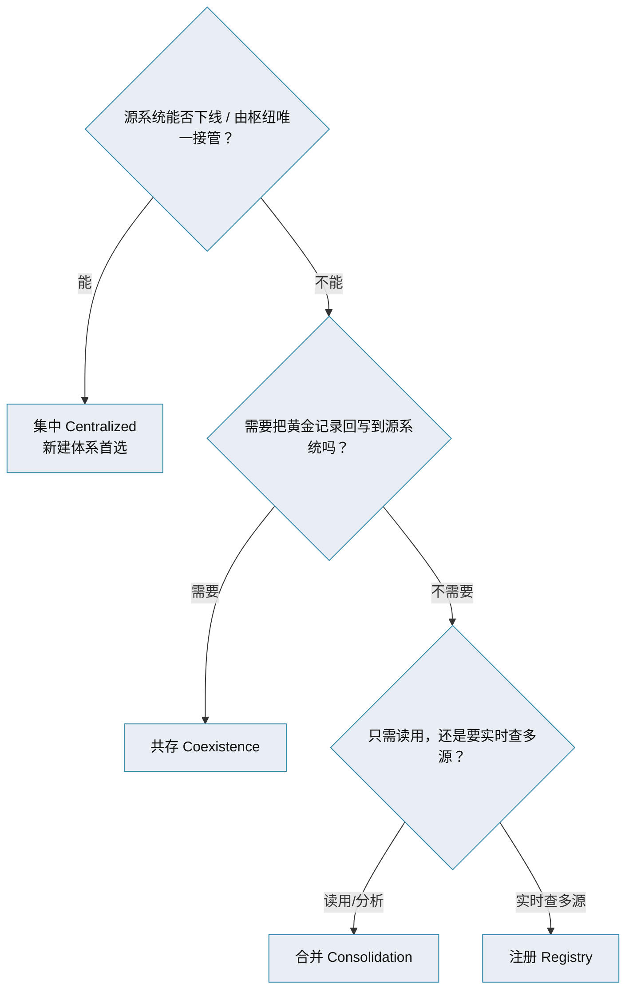

# 主数据管理 · 四种实现风格

> 注册 / 合并 / 共存 / 集中 · 谁说了算 · 对比与选择决策框架

[文档首页](../../../文档首页.md) › [知识档案](../mdm知识档案总览.md) › [主数据管理](01_主数据管理_总览.md) › 四种实现风格　|　[← 返回总览](01_主数据管理_总览.md)

---

## 1. 概述 

主数据管理落地时有四种被行业广泛引用的**实现风格（Implementation Style）**——Registry（注册）、Consolidation（合并）、Coexistence（共存）、Centralized / Transactional（集中）。它们本质是在回答三个问题：

1. **谁是权威源（System of Record）？** 源系统，还是主数据枢纽？
2. **数据存哪？** 枢纽只存索引，还是存黄金记录？
3. **数据回不回源？** 单向汇总，还是双向同步？

## 2. 四种风格详解 

### 2.1 注册（Registry）

- **权威源**：各源系统各自保留权威，枢纽不存明细，只存**全局标识与交叉引用（cross-reference）**、匹配结果与统一视图索引；
- **数据流向**：查询时实时整合多个源；**不回写**源系统；
- **优点**：实施最轻、对源系统侵入最小、快速起步；
- **缺点**：管控最弱，数据质量仍依赖源系统；实时整合对性能有要求；
- **适用**：低治理成熟度、多源仅需「知道是同一个实体」的场景（合规索引、快速起步）。

### 2.2 合并（Consolidation）

- **权威源**：源系统写，枢纽**汇总并清洗**出黄金记录；
- **数据流向**：多源 → 枢纽，**生成黄金记录后不回写**源系统，供分析 / 报表 / 合规消费；
- **优点**：非侵入，黄金记录在枢纽、性能不再受实时整合拖累，可挂数据管家流程；
- **缺点**：源系统仍是各写各的，一致性仅体现在枢纽侧；
- **适用**：面向分析、合规、报表的信任数据源。

### 2.3 共存（Coexistence）

- **权威源**：枢纽与源系统**并存**（枢纽是权威源之一），二者通过集成回路**双向同步**；
- **数据流向**：源系统可写、枢纽也可写，黄金记录**回写**源系统；
- **优点**：既有源系统不下线也能逐步统一口径，贴近真实业务（业务用户在源系统内工作）；
- **缺点**：组织与技术挑战最大（双向同步冲突、环路、治理协作），成本高；
- **适用**：存量系统不可下线/替换、但需统一共享主数据的企业。

### 2.4 集中 / 事务型（Centralized / Transactional）

- **权威源**：枢纽**唯一**，只有枢纽能创建与更新；
- **数据流向**：只在枢纽创作，下游系统**只订阅**、无独立权威；
- **优点**：一致性、管控最强，任一时点全企业一致；
- **缺点**：实施最难、成本最高，需要强执行发起（executive sponsorship）与全面治理；
- **适用**：数字化转型、新建体系、从零构建（无历史源系统包袱）。

## 3. 四风格对比 

| 维度 | 注册 | 合并 | 共存 | 集中 |
| --- | --- | --- | --- | --- |
| 权威源 | 源系统 | 源系统 | 枢纽 + 源系统 | 枢纽唯一 |
| 枢纽存黄金记录 | 否（仅索引） | 是 | 是 | 是 |
| 回写源系统 | 否 | 否 | 是（双向） | 不适用（源系统无权威） |
| 源系统影响 | 无 | 无 | 双向同步 | 只订阅 |
| 黄金记录质量 | 算法级 | 高（已清洗） | 很高 | 最高 |
| 实施成本 / 复杂度 | 低 | 中 | 中高 | 高 |
| 治理成熟度要求 | 低 | 中 | 高 | 高 |
| 典型用途 | 快速起步、多源索引 | 分析 / 合规 | 混合现代化 | 转型 / 新建 |

## 4. 选择决策框架 

**演进规律**：多数组织**从注册或合并起步**（治理轻、见效快），随数据与治理成熟，逐步走向共存或集中。风格不是一次定终身，但要**可演进**——选的架构别把去路堵死。

## 5. 与本项目的对照 

本项目 mdm 作为**主数据唯一创建方与权威出口**，业务产品只引用不建档，源系统不存在「各自为政的主数据权威」——因此属**集中式（Centralized）**。这与「平台 / 产品分层、每服务独立库、写侧唯一归属」的架构一致。详见《[14 项目评估与选型](14_主数据管理_项目评估与选型.md)》与《[13 主数据服务化](13_主数据管理_主数据服务化.md)》。

## 6. 常见误区 

- **把注册当成终点**：注册只解决「知道是同一个」，不解决「口径统一」；长期需向合并/集中演进。
- **低估共存的复杂度**：双向同步的冲突、环路、责任划分是重工程，别为「能回源」轻率选它。
- **集中式当默认**：集中式最强但最重，只在源系统可被接管时选。
- **一次定死、不留演进**：风格可演进，接口与数据模型要留去路。

## 7. 参考文献 

| 资源 | 网址 |
| --- | --- |
| Profisee：MDM Implementation Styles | https://profisee.com/blog/master-data-management-implementation-styles/ |
| Stibo Systems：4 common MDM implementation styles | https://www.stibosystems.com/blog/4-common-master-data-management-implementation-styles |
| Reltio：What are MDM Implementation Styles | https://www.reltio.com/glossary/master-data-management/what-are-mdm-implementation-styles/ |
| Informatica：MDM Implementation Guide | https://www.informatica.com/resources/articles/mdm-implementation.html |

## 8. 项目内关联文档 

| 文档 | 说明 |
| --- | --- |
| 《[01 总览](01_主数据管理_总览.md)》 | 本专题入口 |
| 《[05 架构模式与枢纽拓扑](05_主数据管理_架构模式与枢纽拓扑.md)》 | 枢纽与源系统怎么组网 |
| 《[13 主数据服务化](13_主数据管理_主数据服务化.md)》 | 主数据服务化后的风格落地 |
| 《[mdm 主数据管理规划](../../../规划/mdm主数据管理规划.md)》 | 本项目主数据域与接入形态 |

---

> 依《[文档生成规范](../../../../bms文档/规范/文档生成规范.md)》编写
