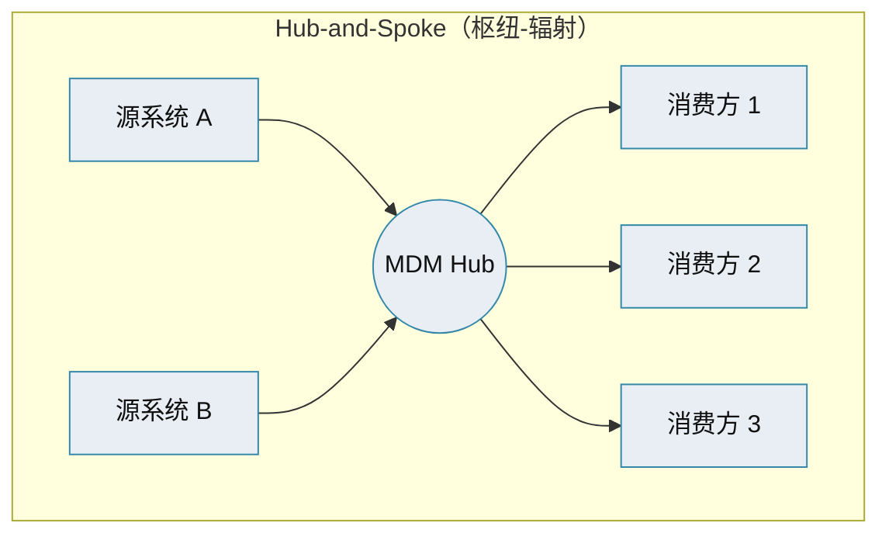
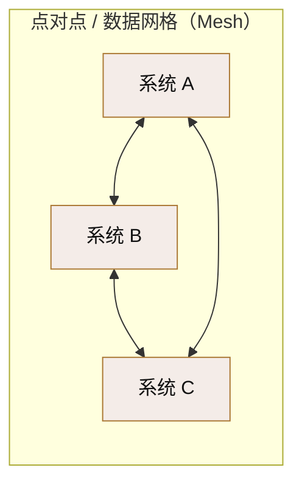
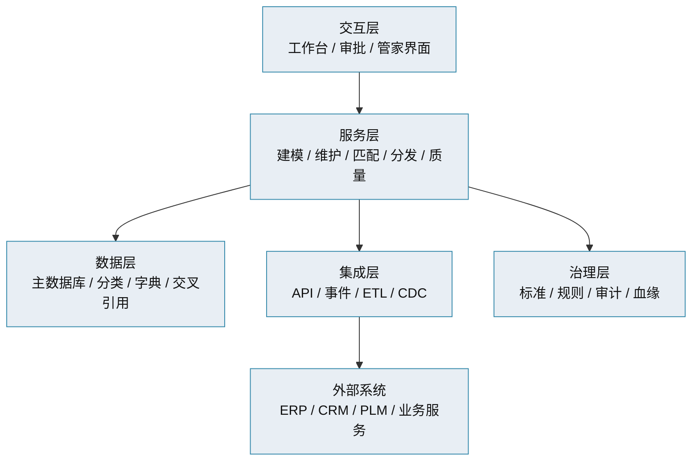

# 主数据管理 · 架构模式与枢纽拓扑

> 主数据枢纽（Hub）如何与源系统、消费方组网 · 集中式 / 分布式 / 混合 · 枢纽内部分层

[文档首页](../../../文档首页.md) › [知识档案](../mdm知识档案总览.md) › [主数据管理](01_主数据管理_总览.md) › 架构模式与枢纽拓扑　|　[← 返回总览](01_主数据管理_总览.md)

---

## 1. 概述 

实现风格（04）回答了「谁是权威源、数据往哪走」，架构模式回答「**物理上怎么摆**」——主数据枢纽（MDM Hub）与源系统、消费方如何组网，枢纽内部又如何分层。本篇讲主流架构模式与枢纽拓扑。

## 2. 三种部署架构 

| 架构 | 数据摆放 | 优点 | 缺点 |
| --- | --- | --- | --- |
| **集中式架构** | 所有主数据集中在一个中心库 | 一致性与标准化易实现 | 有性能瓶颈与单点风险 |
| **分布式架构** | 主数据分布多库/多地 | 可扩展、容错好 | 一致性与标准化复杂 |
| **注册中心架构** | 明细仍在源系统，枢纽只存索引与映射 | 免数据迁移与同步 | 实时查询多源、依赖连通性，性能受影响 |
| **混合架构** | 关键公共主数据集中，敏感/分散主数据分布 + 注册 | 灵活，兼顾管控与自主 | 架构复杂，需清晰切分 |

> 好的 MDM 方案通常**支持多种架构并可配置**，实际按业务需求、技术基础、数据质量与安全灵活取舍。

## 3. 枢纽拓扑（Hub Topology） 

主数据枢纽与周边系统组网，常见两种拓扑：

| 拓扑 | 特点 | 适用 |
| --- | --- | --- |
| **Hub-and-Spoke（枢纽-辐射）** | 所有系统只与枢纽交互，枢纽负责分发与协同 | 主流；变更入口统一、消费方解耦 |
| **点对点 / 数据网格（Mesh）** | 系统两两对接、各域自治 | 大规模自治组织；治理复杂、易失控 |

> 现代 MDM 的集成已从「点对点自定义接口 → hub-spoke 批量同步 → **API-first + 事件驱动**」演进（见《[10 集成与分发](10_主数据管理_集成与分发.md)》）。枢纽仍是分发中心，但分发方式变为**事件发布 / 订阅**，消费方按需订阅，而非枢纽主动推。

## 4. 枢纽内部分层 

主数据枢纽平台内部通常分几层，标准功能模块：

| 层 | 职责 |
| --- | --- |
| 交互层 | 主数据维护工作台、审批流、数据管家处理界面 |
| 服务层 | 建模、维护、匹配合并、分发、质量规则执行 |
| 数据层 | 主数据库（黄金记录）、分类、字典、交叉引用/映射表 |
| 集成层 | 与外部系统的 API / 事件 / 批量 / CDC 通道 |
| 治理层 | 数据标准、规则、审计、血缘与质量度量 |

## 5. 关键架构约束 

- **写侧唯一归属**：同一主数据只有一个写入权威，避免多头可写导致漂移；读侧经契约 / 事件 / 只读投影。
- **不跨库 JOIN**：跨系统读走服务契约或数据副本，不直连他方数据库。
- **缓存与一致性**：消费方可缓存主数据副本（如名称快照），但须能随变更事件失效/刷新，避免长期漂移。
- **单点与高可用**：集中式枢纽是单点，须做高可用与降级（不可达时消费方按既定降级策略处理）。
- **可观测**：分发失败、消费延迟、匹配异常须可监控、可追溯。

## 6. 与本项目的对照 

本项目 mdm 采用**集中式 + Hub-and-Spoke 拓扑**：mdm 各主数据域服务是 hub，bms 平台与 biz 等产品是消费方，经**契约 + 事件**（RocketMQ）交互，不跨库 JOIN、每服务独立库（见 bms《微服务演进规划》与《[mdm 架构设计 · 总览](../../../设计/架构设计/01_架构设计_总览.md)》）。物理上按域拆服务独立部署，属「逻辑集中、物理分布」。

## 7. 参考文献 

| 资源 | 网址 |
| --- | --- |
| Informatica：MDM Integration Architecture | https://www.informatica.com/resources/articles/mdm-integration-architecture.html |
| Solace：Modernizing MDM with EDA | https://solace.com/blog/modernizing-mdm-with-eda/ |
| 知乎：一文讲透主数据管理（架构模式） | https://zhuanlan.zhihu.com/p/628937293 |

## 8. 项目内关联文档 

| 文档 | 说明 |
| --- | --- |
| 《[04 四种实现风格](04_主数据管理_四种实现风格.md)》 | 谁权威、数据往哪走 |
| 《[10 集成与分发](10_主数据管理_集成与分发.md)》 | API / 事件 / 订阅分发 |
| 《[13 主数据服务化](13_主数据管理_主数据服务化.md)》 | 服务化形态下的枢纽 |
| 《[架构设计 · 总览](../../../设计/架构设计/01_架构设计_总览.md)》 | 本项目域服务划分与数据边界 |

---

> 依《[文档生成规范](../../../../bms文档/规范/文档生成规范.md)》编写
