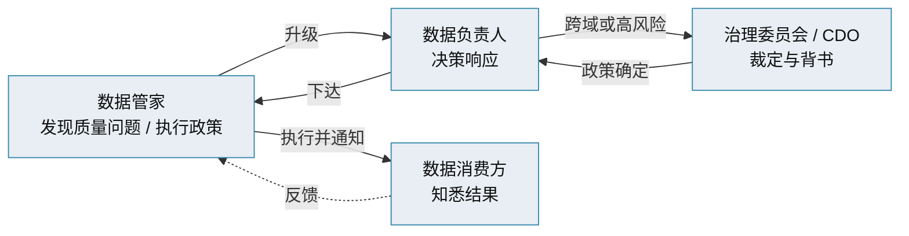

# 主数据管理 · 数据治理与组织

> 数据负责人 / 数据管家 / 技术托管人 · RACI · 中央 / 联邦 / 混合模式

[文档首页](../../../文档首页.md) › [知识档案](../mdm知识档案总览.md) › [主数据管理](01_主数据管理_总览.md) › 数据治理与组织　|　[← 返回总览](01_主数据管理_总览.md)

---

## 1. 概述 

主数据项目成败的**大头不在技术，而在组织、流程与标准**（业界经验：组织 + 流程 + 标准约占 80%）。数据治理（Data Governance）就是为「谁决定、谁执行、按什么规则办」建立制度与责任体系。本篇讲角色、RACI 与组织模式。

## 2. 三个核心角色 

| 角色 | 别称 | 职责 | RACI |
| --- | --- | --- | --- |
| **数据负责人（Data Owner）** | 数据主人 | 对某个数据域**问责**：定政策、批访问、担结果；通常是业务负责人 | **A**（Accountable，问责） |
| **数据管家（Data Steward）** | 数据专员 | 日常**执行**治理：维护定义与元数据、监控质量、处理问题、执行审批 | **R**（Responsible，执行） |
| **技术托管人（Data Custodian）** | 数据保管 | 负责承载数据的**技术基础设施**（库、存储、流转、安全执行） | 支持角色 |
| 治理委员会 / CDO | | 定战略、解跨域升级、对 owner 问责 | **C**（Consulted） |
| 数据消费方 | | 使用主数据、反馈问题 | **I**（Informed） |

> 最常见的失败：把 owner 与 steward 混为一谈。**owner 决策、steward 执行**——即便同一人兼两职（小组织常见），也要能说清「谁决定、谁执行」。

## 3. RACI 协作流 

- **管家行动并升级、负责人决策、委员会在高风险时介入、消费方在定案后知悉**；
- 权限分配同理：消费方申请访问 → 管家按既有政策直接办 → 若政策未覆盖则上 owner 决策。

## 4. 三种组织模式 

| 模式 | 说明 | 适用 | 代价 |
| --- | --- | --- | --- |
| **中央式（Centralized）** | 一个小核心团队统一负责全组织治理决策 | 小型组织 | 随域增多成为瓶颈 |
| **联邦式（Federated / 数据网格）** | 各域自设 owner + steward，中央委员会定共享标准 | 大规模、自治需求强 | 需更强协同纪律 |
| **混合式（Hybrid）** | 中央定政策与工具标准，各域在框架内执行 | 大多数成熟组织 | 需清晰切分中央与域职责 |

> 本篇的「中央 / 联邦」是**治理组织模式**，与《[04 四种实现风格](04_主数据管理_四种实现风格.md)》的「数据架构风格」是两回事，勿混。

## 5. 制度与流程构件 

治理要落到可执行的制度与流程：

- **数据标准管理办法**：标准怎么定、怎么改、谁批准；
- **主数据管理流程**：申请、变更、审批、冻结、注销的流程与责任（见《[09 生命周期与工作流](09_主数据管理_生命周期与工作流.md)》）；
- **数据质量管理办法**：质量规则、稽核、问题闭环（见《[08 数据质量与匹配合并](08_主数据管理_数据质量与匹配合并.md)》）；
- **安全与权限**：访问控制、脱敏、审计、合规；
- **考核与激励**：把数据质量纳入责任考核，治理才「带电」。

## 6. 系统落地时治理怎么承载 

治理不能只停在文档，要在系统里「有抓手」：

| 治理要素 | 系统承载 |
| --- | --- |
| 数据负责人 / 管家 | 角色与权限（按域授权、审批流角色） |
| 审批流程 | 工作流引擎（申请→审核→发布） |
| 责任归属 | 审计日志（谁在何时改了什么） |
| 质量规则 | 校验规则库、稽核任务、质量看板 |
| 数据血缘 | 分发台账、消费方登记 |

> 本项目平台侧已提供 RBAC 权限、工作流、审计哈希链、事件总线等能力，mdm 复用而不重复实现（见《[mdm 主数据管理规划](../../../规划/mdm主数据管理规划.md)》「平台复用边界」节）。

## 7. 常见误区 

- **只建系统不建组织**：没有 owner/steward，数据错了没人管。
- **owner 与 steward 不分**：决策与执行混一起，问题无升级路径。
- **治理无抓手**：制度只写在纸上，系统里没有审批、审计、质量规则落地。
- **中央式一刀切**：随着域增多，一个小团队管不过来，应收敛为混合式。

## 8. 参考文献 

| 资源 | 网址 |
| --- | --- |
| IBM：什么是数据管家（Data Stewardship） | https://www.ibm.com/think/topics/data-stewardship |
| Soda：Data Steward vs Data Owner（RACI） | https://soda.io/blog/data-steward-vs-data-owner |
| 《数字供应链商贸主数据管理规范》（保障体系） | https://www.ttbz.org.cn/upload/file/20250312/6387738562674193056188811.pdf |

## 9. 项目内关联文档 

| 文档 | 说明 |
| --- | --- |
| 《[09 生命周期与工作流](09_主数据管理_生命周期与工作流.md)》 | 审批流程与状态机 |
| 《[08 数据质量与匹配合并](08_主数据管理_数据质量与匹配合并.md)》 | 质量规则与闭环 |
| 《[mdm 主数据管理规划](../../../规划/mdm主数据管理规划.md)》 | 本项目平台复用边界 |

---

> 依《[文档生成规范](../../../../bms文档/规范/文档生成规范.md)》编写
