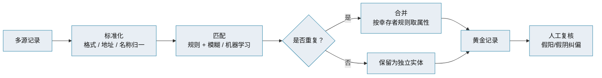
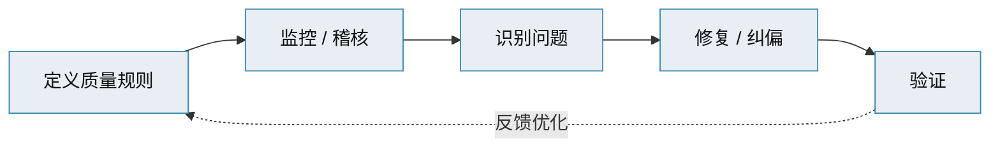

# 主数据管理 · 数据质量与匹配合并

> 数据质量六维 · 匹配合并（Match & Merge）· 幸存者规则 · 黄金记录

[文档首页](../../../文档首页.md) › [知识档案](../mdm知识档案总览.md) › [主数据管理](01_主数据管理_总览.md) › 数据质量与匹配合并　|　[← 返回总览](01_主数据管理_总览.md)

---

## 1. 概述 

主数据的价值全系于「可信」二字——**黄金记录若有质量问题，比没有更糟**（下游会信任它）。本篇讲两件事：数据质量怎么衡量与治理、多源记录怎么匹配合并成黄金记录。

## 2. 数据质量六维 

行业通用六个维度（可扩展 integrity / traceability 等）：

| 维度 | 含义 | 度量示例 |
| --- | --- | --- |
| **准确性** | 是否反映真实世界、可对照可信来源 | 地址与工商登记一致率 |
| **完整性** | 必填值是否都存在 | 必填字段填充率 |
| **一致性** | 同一信息在不同记录/系统是否匹配 | 电话区号格式统一率 |
| **唯一性** | 每个实体是否只有一条记录 | 重复记录数 / 占比 |
| **及时性** | 数据是否足够新、随变更更新 | 变更分发延迟 |
| **有效性** | 是否符合取值约束与格式规范 | 枚举值合规率、邮箱格式 |

> 质量维度要**结合业务定义**：客户数据重「唯一、准确」；产品数据重「完整」；合规场景重「准确、一致」。度量指标（百分比）要能被监控与改进。

## 3. 质量问题从哪来 

| 环节 | 典型问题 |
| --- | --- |
| 采集录入 | 手工录入错误、格式不一、部门口径不同 |
| 集成同步 | 批量 ETL 与实时整合不一致、映射丢失 |
| 匹配合并 | 误匹配（假阳）、漏匹配（假阴）、合并冲突 |
| 生命周期 | 过期数据未失效、注销数据仍被引用 |
| 治理缺失 | 无规则、无稽核、问题无闭环 |

## 4. 匹配合并（Match & Merge） 

多源主数据要形成黄金记录，核心是**识别「同一个实体」并合并**：

| 步骤 | 说明 |
| --- | --- |
| **标准化** | 统一格式、地址解析、名称归一（大小写、全半角、简称） |
| **匹配** | 确定性规则（证件号/税号相同）+ 模糊匹配（名称相似度、地址相似度、空间聚类） |
| **合并** | 把匹配到的记录合并为一条 |
| **幸存者规则（Survivorship）** | 合并时每个属性取哪条记录的值：**优先级**（最可信源优先）、**最新**、**最完整**、**最常用值**等 |
| **人工复核** | 对假阳（错合）、假阴（漏合）人工纠偏，形成反馈规则 |

> 幸存者规则决定黄金记录「长什么样」，须**与业务确认**：同一个「客户名称」字段，取 CRM 的还是 ERP 的，直接影响下游。

## 5. 质量治理闭环 

- **规则要固化在系统里**（校验、查重、稽核任务），而非靠人肉；
- **持续运营**是发挥价值的关键：实施只是开始，不做持续稽核，质量会「回到解放前」；
- **质量看板**暴露问题、跟踪闭环，把质量纳入考核。

## 6. 与本项目的对照 

本项目 mdm 采用**集中式**（唯一权威创建方），不存在多源匹配合并的复杂场景——主数据在 mdm 内创建与维护，天然唯一。因此：

- **质量重点前移到「录入校验 + 唯一约束」**：新建/变更时按标准校验（必填、格式、唯一），从源头控质；
- **分发一致性靠事件**：变更发布事件，消费方刷新缓存/快照，避免漂移；
- **存量导入**（如从 biz 迁入供应商/客户）才需要一次性清洗与查重。

> 匹配合并的完整能力（模糊匹配、幸存者规则、数据管家复核）在集中式新体系中**按需**引入，不作为首批必需。详见《[14 项目评估与选型](14_主数据管理_项目评估与选型.md)》。

## 7. 参考文献 

| 资源 | 网址 |
| --- | --- |
| IBM：数据质量维度 | https://www.ibm.com/think/topics/data-quality-dimensions |
| Collibra：The 6 Dimensions of Data Quality | https://www.collibra.com/blog/the-6-dimensions-of-data-quality |
| Profisee：Data Quality 指南 | https://profisee.com/data-quality-what-why-how-who/ |
| Reltio：Match and Merge Concepts | https://www.reltio.com/glossary/master-data-management/what-are-mdm-implementation-styles/ |

## 8. 项目内关联文档 

| 文档 | 说明 |
| --- | --- |
| 《[06 数据标准与数据模型](06_主数据管理_数据标准与数据模型.md)》 | 校验规则来自数据标准 |
| 《[09 生命周期与工作流](09_主数据管理_生命周期与工作流.md)》 | 录入与变更的审批控质 |
| 《[14 项目评估与选型](14_主数据管理_项目评估与选型.md)》 | 本项目集中式下的质量口径 |

---

> 依《[文档生成规范](../../../../bms文档/规范/文档生成规范.md)》编写
