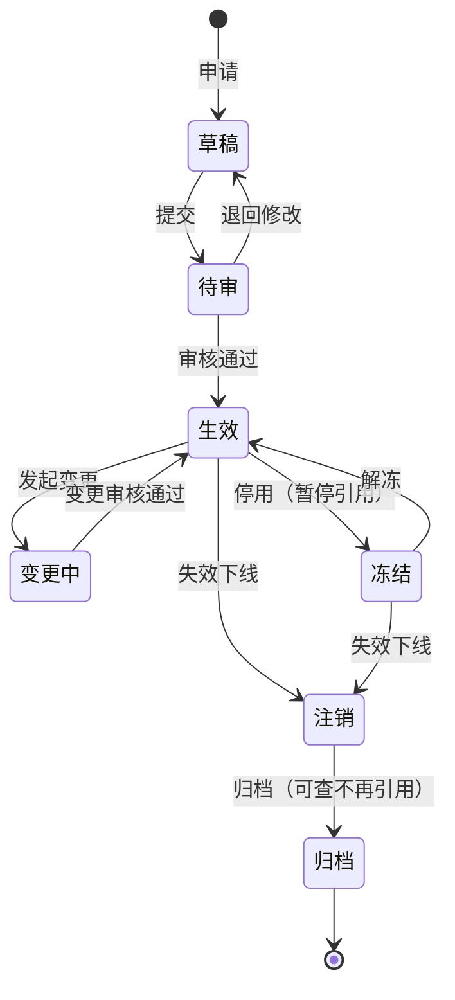

# 主数据管理 · 生命周期与工作流

> 申请 → 审核 → 创建 → 变更 → 冻结/注销 → 归档 · 状态机 · 分发触发

[文档首页](../../../文档首页.md) › [知识档案](../mdm知识档案总览.md) › [主数据管理](01_主数据管理_总览.md) › 生命周期与工作流　|　[← 返回总览](01_主数据管理_总览.md)

---

## 1. 概述 

主数据不是「建完就不动」的静态档案，它有完整的**生命周期**：从申请、审核、创建，到变更、冻结、注销、归档。管好生命周期 = 从源头控质 + 全程可追溯 + 出口可控。本篇讲生命周期各阶段与工作流设计。

## 2. 生命周期全景 

| 阶段 | 含义 | 关键动作 |
| --- | --- | --- |
| **申请 / 草稿** | 一线或补录入口发起新增，统一收口 | 必填校验、字段联动、暂存 |
| **审核 / 待审** | 按流程审批，源头控质 | 审核通过 / 退回 |
| **生效** | 主数据正式可用 | 发布事件、可被引用 |
| **变更** | 修改属性或状态 | 变更审批、版本可追溯 |
| **冻结 / 停用** | 暂停使用但保留 | 退出引用、权限收敛 |
| **注销 / 失效** | 下线不再使用 | 触发下游清理 |
| **归档** | 历史可查、不再参与新业务 | 只读归档 |

> **设计要点**：主数据不能「谁想创建就创建」——申请与审核流程的意义是**从源头控制质量，而不是事后补救**。归档与注销机制则保证历史可查、失效不再被引用。

## 3. 状态与动作口径 

各域状态口径不同，但通用动作可归纳：

| 通用动作 | 语义 | 影响 |
| --- | --- | --- |
| 新建 / 提交 | 创建草稿并提交 | 进入待审 |
| 审核 / 批准 | 审核通过 | 转生效 |
| 退回 | 审核不通过 | 回草稿 |
| 修改 / 变更 | 改属性 | 走变更审批 |
| 移动 | 调整层次归属（如部门改父级） | 级联维护子树 |
| 冻结 / 解冻 | 停用 / 恢复 | 退出 / 恢复引用 |
| 注销 | 失效 | 触发下游清理 |
| 归档 | 转历史 | 只读 |

> 本项目对动作码与权限码有统一登记（如 `org:update`、`org:move`），见《[mdm 英文简称规范](../../../规范/英文简称规范.md)》。

## 4. 工作流设计要点 

- **流程可配置**：不同域、不同重要度的数据审核级别不同（小改动免审、关键字段必审）；
- **职责明确**：谁申请、谁审核、谁执行，与治理角色（见《[07 数据治理与组织](07_主数据管理_数据治理与组织.md)》）对齐；
- **全程留痕**：谁在何时改了什么、走了什么审批，进审计；
- **变更即分发**：生效/变更/注销都触发分发（见《[10 集成与分发](10_主数据管理_集成与分发.md)》）；
- **幂等与并发**：同一记录并发变更要串行化或乐观锁，避免覆盖。

## 5. 删除策略：物理删除 vs 逻辑删除 

| 策略 | 说明 | 适用 |
| --- | --- | --- |
| 逻辑删除（软删） | 标记删除位，数据保留 | **主数据首选**：被下游引用，物理删会断链 |
| 物理删除 | 真正删除记录 | 仅限从未被引用 / 合规要求彻底清除 |
| 归档 | 迁入历史表 / 只读态 | 长期不再使用但需可查 |

> 主数据被多系统引用，**默认逻辑删除 + 冻结/注销状态**，物理删除须走例外审批。

## 6. 与分发的关系 

生命周期事件是分发的触发源：创建/变更/冻结/注销都对应一类分发事件，下游据此同步或清理缓存。**分发失败要有监控与重发**（见《[10 集成与分发](10_主数据管理_集成与分发.md)》「分发监控」节）。

## 7. 参考文献 

| 资源 | 网址 |
| --- | --- |
| qData-mdm：主数据建模 / 维护 / 变更 / 冻结 / 失效 | https://github.com/qiantongtech/qData-mdm |
| 知乎：主数据管理管的是什么（生命周期） | https://zhuanlan.zhihu.com/p/2020180548711096428 |
| fulemin MDM：主数据生命周期（新增 / 审核 / 分发） | http://fulemin.com/mdm/7.3.0/INTRODUCTION.html |

## 8. 项目内关联文档 

| 文档 | 说明 |
| --- | --- |
| 《[07 数据治理与组织](07_主数据管理_数据治理与组织.md)》 | 审批流程的责任角色 |
| 《[10 集成与分发](10_主数据管理_集成与分发.md)》 | 生命周期事件触发的分发 |
| 《[mdm 英文简称规范](../../../规范/英文简称规范.md)》 | 动作码与权限码登记 |
| 《[概要设计 · 总览](../../../设计/概要设计/01_概要设计_总览.md)》 | 各域功能流程 |

---

> 依《[文档生成规范](../../../../bms文档/规范/文档生成规范.md)》编写
