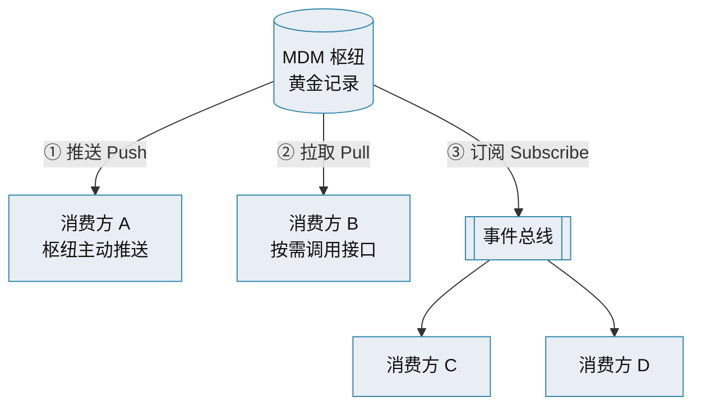
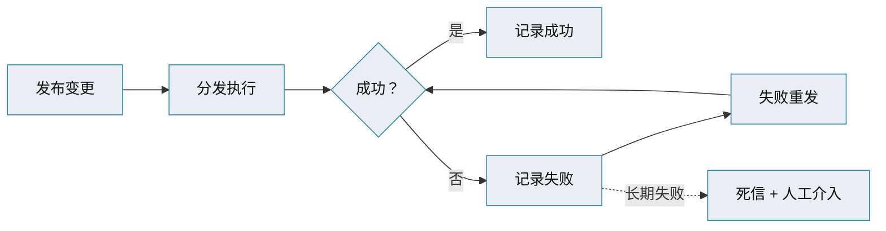

# 主数据管理 · 集成与分发

> ETL / 实时整合 / CDC · 推送 / 拉取 / 订阅 · API-first + 事件驱动 · 分发监控

[文档首页](../../../文档首页.md) › [知识档案](../mdm知识档案总览.md) › [主数据管理](01_主数据管理_总览.md) › 集成与分发　|　[← 返回总览](01_主数据管理_总览.md)

---

## 1. 概述 

主数据的价值在**流动**——把权威数据集成进来、把变更分发给下游消费方。本篇讲集成方式、分发模式，以及现代架构「API-first + 事件驱动」的演进。

## 2. 集成方式 

| 方式 | 说明 | 时延 | 适用 |
| --- | --- | --- | --- |
| **批量 ETL / ELT** | 定时抽取-清洗-加载 | 分钟~天 | 初始加载、存量迁移、分析 |
| **实时 API 整合** | 调用源系统/枢纽接口即时取数 | 毫秒~秒 | 查询型整合、注册风格 |
| **CDC（变更数据捕获）** | 捕获数据库变更日志推送 | 秒级 | 高频、近实时同步 |
| **事件驱动** | 变更发布事件，消费方订阅 | 秒级 | **现代首选**（见下） |

> 演进路径：**点对点自定义接口 → hub-spoke 批量同步 → API-first + 事件驱动、云原生**。分布式/微服务生态下，事件驱动是主流。

## 3. 分发的三种方式 

| 方式 | 机制 | 优点 | 缺点 |
| --- | --- | --- | --- |
| **推送（Push）** | 枢纽主动调消费方接口 | 实时、主动 | 需知道消费方、耦合较高、失败重试复杂 |
| **拉取（Pull）** | 消费方按需调枢纽接口 | 解耦、消费方自控节奏 | 非实时、可能反复轮询 |
| **订阅（Subscribe）** | 枢纽发布变更事件，消费方订阅 | **最解耦、可多消费方、天然可扩展** | 需事件总线、最终一致、需幂等 |

> **订阅制（发布/订阅）是现代主数据分发的首选**：主数据变更（创建/更新/删除/合并）发布事件到消息平台（Kafka / RocketMQ / Pub-Sub 等），下游按需订阅、自动更新，无需轮询。

## 4. 现代集成架构要点 

- **API-first**：REST（CRUD）+ 灵活查询（如 GraphQL），对外稳定契约、版本化管理；
- **事件驱动**：变更事件走消息总线，解耦生产者与消费者，天然支持多消费方；
- **只加不删的事件契约**：事件字段向后兼容，版本演进不破坏消费方；
- **幂等消费**：至少一次投递 + 消费去重，重复事件只生效一次；
- **缓存副本一致性**：消费方缓存主数据副本（名称快照等）须能随事件刷新，避免漂移；
- **分发监控闭环**：分发批次 / 明细可查，失败可重发，「发现异常—处理—再验证」闭环。

## 5. 分发监控与失败处理 

- 分发要有**批次与明细台账**，可查执行结果；
- 失败可**重发**，长期失败进**死信**并告警；
- 关键路径可加**一致性屏障**（执行前校验目标变更是否已应用，未应用则有界等待），见 bms 知识档案《分布式事务 · 一致性屏障》。

## 6. 与本项目的对照 

本项目 mdm 的分发方式：

- **读**：biz 等消费方经 mdm **公开契约**（REST）拉取，或用**名称快照**；禁止跨库 JOIN；
- **变更**：主数据变更发布 **RocketMQ 事件**（`org.*` / `sup.*` 等），消费方订阅，落本地投影 / 刷新缓存；
- **一致性**：跨服务读用「逻辑外键 + 契约 / 快照」，最终一致 + 幂等（bms《微服务演进规划》S2/S3）。

## 7. 参考文献 

| 资源 | 网址 |
| --- | --- |
| Informatica：MDM Integration Architecture | https://www.informatica.com/resources/articles/mdm-integration-architecture.html |
| Solace：Modernizing Enterprise MDM with EDA | https://solace.com/blog/modernizing-mdm-with-eda/ |
| Medium：MDM in Microservices Architecture | https://medium.com/@v4sooraj/master-data-management-mdm-in-microservices-architecture-98f9ef6f3281 |
| 知乎：一文讲透主数据管理（分发方式） | https://zhuanlan.zhihu.com/p/628937293 |

## 8. 项目内关联文档 

| 文档 | 说明 |
| --- | --- |
| 《[05 架构模式与枢纽拓扑](05_主数据管理_架构模式与枢纽拓扑.md)》 | 枢纽与消费方组网 |
| 《[09 生命周期与工作流](09_主数据管理_生命周期与工作流.md)》 | 变更事件触发分发 |
| 《[13 主数据服务化](13_主数据管理_主数据服务化.md)》 | 服务化下的分发展开 |
| bms《微服务演进规划》《架构设计 · 事件总线》《架构设计 · 服务间通信与一致性》 | 本项目集成与一致性权威口径（基座） |
| bms 知识档案《[分布式事务 · 一致性屏障](../../../../bms文档/资料/知识档案/分布式事务/04_分布式事务_一致性屏障.md)》 | 执行前收敛机制 |

---

> 依《[文档生成规范](../../../../bms文档/规范/文档生成规范.md)》编写
