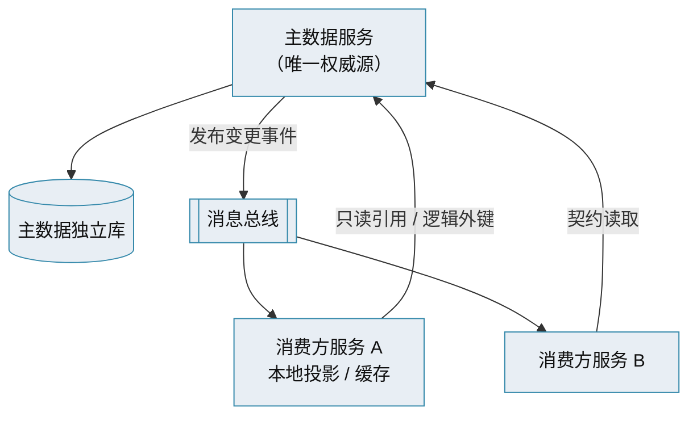

# 主数据管理 · 主数据服务化

> 专用主数据服务 · 每服务独立库 · 事件驱动 · 与微服务架构一致

[文档首页](../../../文档首页.md) › [知识档案](../mdm知识档案总览.md) › [主数据管理](01_主数据管理_总览.md) › 主数据服务化　|　[← 返回总览](01_主数据管理_总览.md)

---

## 1. 概述 

在微服务与分布式架构下，主数据管理不再是「一个大单体里的一组表」，而是**独立的服务**：一个（或按域拆多个）专用主数据服务，拥有自己的库，对外只经契约与事件。本篇讲主数据服务化的标准做法与关键约束。

## 2. 标准做法：专用主数据微服务 

社区共识（Stack Overflow、Medium 等）的主数据服务化做法：

1. **建一个独立的主数据服务**（或按域拆多个），作为主数据的**唯一权威源**；
2. 主数据服务**拥有自己的数据库**（database-per-service），不与其他服务共享库；
3. 主数据**实体变更发布事件**到消息总线；
4. **消费方订阅事件**，在本地维护只读投影 / 缓存，或以逻辑外键 + 快照引用；
5. 读主数据走**服务契约**，禁止跨库直接访问。

## 3. 关键约束 

| 约束 | 说明 |
| --- | --- |
| 写侧唯一归属 | 主数据只有一个服务可写；其他服务只读 |
| 不共享库、不跨库 JOIN | 每服务独立库（database-per-service） |
| 读经契约 / 事件 | 跨服务读用公开契约、事件或只读投影 |
| 最终一致 | 变更经事件传播，接受短暂中间态，靠幂等 + 重试收敛 |
| 缓存副本可失效 | 消费方缓存（名称快照等）须随变更事件刷新 |
| 契约版本化 | 对外契约「只加不删」、版本化、破坏性变更走门禁 |
| 一致性与可观测 | Outbox + 幂等 + 死信；分发失败可监控可重发 |

## 4. 按域拆服务 vs 单主数据服务 

| 方案 | 优点 | 缺点 | 适用 |
| --- | --- | --- | --- |
| 单主数据服务（所有域） | 运维简单、域间关系好处理 | 单服务随域增多臃肿，独立演进受限 | 域少、规模小 |
| **按域拆服务**（每域一服务一库） | 独立演进、独立发布、故障隔离 | 跨域关系需契约协调，运维面变大 | **域多、需独立演进** |

> 划分原则：按限界上下文 / 业务能力垂直切分，与《[03 数据域划分与分类](03_主数据管理_数据域划分与分类.md)》「与限界上下文对齐」一致。

## 5. 与「插件化」「微服务」的关系 

- **与微服务**：主数据服务化是微服务「按业务域独立部署、每服务独立库」原则在主数据上的自然结果；主数据服务只是众多业务服务之一。
- **与插件化**：主数据服务**内部**的横切能力（认证、审计、缓存、匹配算法等）可作为可替换实现，走平台插件机制；但**服务边界本身不因插件化而合并**（见 bms 知识档案《[插件化架构 · 总览](../../../../bms文档/资料/知识档案/插件化架构/01_插件化架构_总览.md)》「与微服务并存」节）。
- **与缓存**：消费方缓存主数据需可失效；强一致场景可用一致性屏障（见 bms 知识档案《[分布式事务 · 一致性屏障](../../../../bms文档/资料/知识档案/分布式事务/04_分布式事务_一致性屏障.md)》）。

## 6. 与本项目的对照 

本项目 mdm 正是「**按域拆服务**」的服务化形态：

- 组织 / 供应商 / 客户 / 物料**按主数据域拆服务**，**每服务独立库**（× 每租户）；
- 以**产品服务（独立服务）**形态接入 BMS 平台（OIDC 认证 + 开放接口 + 事件）；
- 对外**只读出口 + 事件**：`BaseOrgDataSource` / `BaseOrgNameResolver` 等契约、`org.*` / `sup.*` 事件；
- 业务产品（biz）以**逻辑外键 + 快照**引用，禁止跨库 JOIN。

> 见《[mdm 主数据管理规划](../../../规划/mdm主数据管理规划.md)》「平台复用边界」「与业务产品的引用边界」节与《[架构设计 · 总览](../../../设计/架构设计/01_架构设计_总览.md)》。

## 7. 参考文献 

| 资源 | 网址 |
| --- | --- |
| Stack Overflow：MDM Strategies in Microservices | https://stackoverflow.com/questions/57738802/master-data-management-strategies-in-microservices-paradigm |
| Medium：MDM in Microservices Architecture | https://medium.com/@v4sooraj/master-data-management-mdm-in-microservices-architecture-98f9ef6f3281 |
| Informatica：MDM Integration Architecture | https://www.informatica.com/resources/articles/mdm-integration-architecture.html |

## 8. 项目内关联文档 

| 文档 | 说明 |
| --- | --- |
| 《[10 集成与分发](10_主数据管理_集成与分发.md)》 | 契约与事件分发 |
| 《[14 项目评估与选型](14_主数据管理_项目评估与选型.md)》 | 本项目服务化代入 |
| bms《微服务演进规划》 | 服务清单、每服务独立库、服务化地基（基座） |
| bms 知识档案《[插件化架构 · 总览](../../../../bms文档/资料/知识档案/插件化架构/01_插件化架构_总览.md)》 | 插件化与微服务的边界 |

---

> 依《[文档生成规范](../../../../bms文档/规范/文档生成规范.md)》编写
