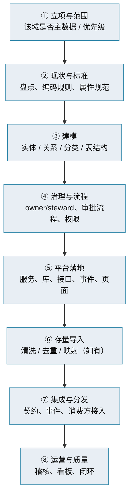

# 主数据管理 · 落地实施指南

> 从零建一个主数据域的 SOP · 分阶段 · 检查清单

[文档首页](../../../文档首页.md) › [知识档案](../mdm知识档案总览.md) › [主数据管理](01_主数据管理_总览.md) › 落地实施指南　|　[← 返回总览](01_主数据管理_总览.md)

---

## 1. 概述 

本篇把前 14 篇的结论收成一份**可操作的实施 SOP**——从一个主数据域的角度，回答「先做什么、再做什么、怎么算做完」。适用于本项目按域落地（如组织域、供应商域）。

## 2. 实施步骤 

| 步骤 | 关键动作 | 产出 |
| --- | --- | --- |
| ① 立项与范围 | 用判定尺确认是否主数据；排优先级 | 域立项、范围说明 |
| ② 现状与标准 | 盘点现有数据与系统；定编码规则、属性规范、分类 | 数据标准 |
| ③ 建模 | 实体、关系、分类、逻辑/物理模型、表结构 | 概要设计 + 数据表文件 |
| ④ 治理与流程 | 定 owner/steward；设计申请-审核-变更流程；权限码 | 治理制度 + 流程设计 |
| ⑤ 平台落地 | 域服务、独立库、REST 契约、事件、维护页面 | 可用服务 |
| ⑥ 存量导入 | 抽取、清洗、查重、映射、加载（新建体系可略） | 初始化数据 |
| ⑦ 集成与分发 | 契约读、事件订阅、消费方接入、快照 | 打通引用链路 |
| ⑧ 运营与质量 | 质量规则、稽核任务、看板、问题闭环 | 持续运营机制 |

## 3. 设计检查清单（落地前） 

- □ 已确认该域属「跨业务共享主数据」（判定尺见《[02 概念与边界](02_主数据管理_概念与边界.md)》）
- □ 编码规则符合七原则（唯一 / 稳定 / 简易 / 规范 / 统一 / 可扩展 / 可理解）
- □ 属性围绕跨业务共享特征建模，未把各部门需求全堆进来
- □ 实体、关系、分类、字典均已定义；跨域关系用逻辑外键
- □ 数据负责人 / 数据管家已明确，审批流程与权限码已登记
- □ 表结构先落表文件（含变更记录）→ 模型 → 迁移，两处状态一致
- □ 对外契约「只加不删」、版本化；事件契约同样向后兼容
- □ 分发失败可监控、可重发；关键路径一致性策略已定

## 4. 落地检查清单（上线前） 

- □ 域服务独立部署、独立库（× 每租户），未与平台/其他服务共享库
- □ 未跨库 JOIN；跨服务读经契约或事件/投影
- □ 录入校验 + 唯一约束到位（源头控质）
- □ 主数据变更发布事件；消费方已接入并可刷新缓存
- □ 审计已接入（谁改了什么可追溯）
- □ 存量数据（如有）已清洗、查重、映射完成
- □ 质量规则与稽核任务已配置
- □ 接口契约快照（OpenAPI）已生成并联调通过

## 5. 常见坑 

- **先建库后立标准**：返工成本极高，务必标准先行；
- **属性贪多**：把业务专属字段塞进主数据，模型臃肿、迭代受阻；
- **分发只管「发」不管「到没到」**：失败无监控、无重发，下游静默漂移；
- **治理只写文档**：系统里没有审批、审计、质量规则，制度落不了地；
- **忽视持续运营**：上线即撒手，质量回退。

## 6. 与本项目的衔接 

本项目按域落地的组织方式（需求 → 任务 → 计划 → 详细设计 → 实施 → 测试）遵循 bms《AI 开发规范》；本指南是其「主数据域」视角的实施清单，不替代项目文档体系。

## 7. 参考资源 

| 资源 | 说明 |
| --- | --- |
| 本专题《[11 成熟度与实施方法论](11_主数据管理_成熟度与实施方法论.md)》 | 七阶段方法论 |
| 《[14 项目评估与选型](14_主数据管理_项目评估与选型.md)》 | 本项目口径 |
| bms《AI 开发规范》《需求/任务/计划文档规范》 | 项目文档与交付流程（基座） |

## 8. 项目内关联文档 

| 文档 | 说明 |
| --- | --- |
| 《[mdm 主数据管理规划](../../../规划/mdm主数据管理规划.md)》 | 本项目规划 |
| 《[概要设计 · 总览](../../../设计/概要设计/01_概要设计_总览.md)》 | 各域模块设计 |
| 《[mdm 英文简称规范](../../../规范/英文简称规范.md)》 | 标识符与动作码登记 |

---

> 依《[文档生成规范](../../../../bms文档/规范/文档生成规范.md)》编写
