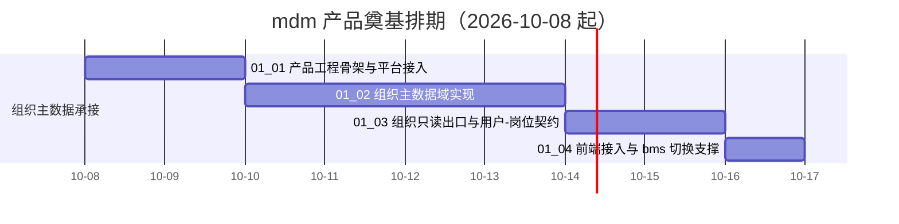

# mdm 产品奠基计划

> mdm 主数据管理 · 阶段一（mdm 产品奠基）排期计划：已完成 0 项，剩余 4 项（组织主数据承接）

[文档首页](../../../文档首页.md) › mdm 产品奠基计划　|　[任务基线 →](../任务/01_组织主数据承接/01_组织主数据承接.md)　[需求基线 →](../需求/00_需求_mdm产品奠基.md)

## 1. 计划说明 

- **排期对象**：阶段一 4 条需求**已全部建任务基线**——需求域一 [组织主数据承接](../任务/01_组织主数据承接/01_组织主数据承接.md)（4 子任务）。
- **顺序口径**：工程骨架与平台接入（01_01）→ 组织主数据域实现（01_02）→ 组织只读出口与用户-岗位契约（01_03）→ 前端接入与 bms 切换支撑（01_04）。**mdm 先实现、bms 后退役**：bms 侧组织服务退役（bms 阶段二 需求域十一）随本阶段 `01_03` 交付后推进。
- **排期口径**：自 **2026-10-08** 起串行；单条窗口见 §3。
- **工时**：阶段合计 **72h**（01_01 16h + 01_02 32h + 01_03 16h + 01_04 8h）。
- **里程碑锚点**：mdm 阶段一「组织主数据承接」——组织主数据域可用、组织只读出口与用户-岗位契约就绪、bms `org` 服务退役可切契约。
- **负责人**：minjian（兼职，单人）。

## 2. 已完成任务（暂空） 

| 编号 | 任务 | 工时（重估） | 完成日期 | 任务文件 | 偏差与遗留 |
| --- | --- | --- | --- | --- | --- |
| — | （阶段起步，暂无已完成任务） | — | — | — | — |

## 3. 剩余任务排期（自 2026-10-08） 

| 编号 | 任务 | 状态 | 工时 | 依赖 | 排期窗口 | 备注 | 偏差与遗留 |
| --- | --- | --- | --- | --- | --- | --- | --- |
| 01_01 | mdm 产品工程骨架与平台接入 | 未开始 | 16h | 无 | 2026-10-08 ~ 2026-10-09 | 后端服务工程 + OIDC / 开放接口 / 事件接入 + 服务目录登记 | 无 |
| 01_02 | 组织主数据域实现 | 未开始 | 32h | 01_01 | 2026-10-10 ~ 2026-10-13 | 五表（org_dept / org_post / org_user_post / org_role_post / org_role_dept）+ CRUD + 权限 + 审计 + 校验 | 无 |
| 01_03 | 组织只读出口与用户-岗位契约 | 未开始 | 16h | 01_02 | 2026-10-14 ~ 2026-10-15 | 组织数据源 / 名称回显两契约 + 用户-岗位契约 + 按用户解析角色契约 + 事件 | 无 |
| 01_04 | 前端接入与 bms 切换支撑 | 未开始 | 8h | 01_03 | 2026-10-16 | 组织选择字段切 mdm 出口 + 契约类型 + 联调验收 | 无 |

## 4. 排期甘特图 

## 5. 阶段一验收门禁 

| 验收点 | 对应任务 | 达成路径（结论与证据索引） |
| --- | --- | --- |
| mdm 服务可启动、经网关可达、服务目录登记通过 | 01_01 | 待填（交付时登记 `/healthz` `/readyz`、网关可达、`sys_module` 登记校验结论与证据） |
| 组织主数据域 CRUD 与部门树可用、校验与审计生效 | 01_02 | 待填（交付时登记 CRUD / 部门树 / 校验 / 审计用例与覆盖率） |
| 组织只读出口真实取数、用户-岗位与按用户解析角色契约可用、事件发布 | 01_03 | 待填（交付时登记契约实现、事件发布与消费方联调结论） |
| 前端组织选择经 mdm 出口联通、bms `org` 服务退役验收通过 | 01_04 | 待填（交付时登记前端联调与 bms 退役验收结论） |

## 6. 风险与对策 

| 风险 | 影响 | 概率 | 缓解措施 |
| --- | --- | --- | --- |
| mdm 从零奠基，工程 / CI / 部署新建面大 | 中 | 高 | 平台能力（认证 / 权限 / 审计 / 事件 / 文件 / 字典）一律复用 bms，只建主数据域；组织域单域先落，其余域按需接入 |
| mdm 出口未就绪阻塞 bms 退役 | 中 | 中 | 顺序固定「mdm 先、bms 后」；bms 退役任务窗口排于 mdm `01_03` 之后（见 bms 阶段二计划） |
| 契约迁出（`bms_core/org` → mdm）影响面未清 | 中 | 中 | 退役前逐项核对 bms 侧调用点（`assembly` / `deps` / 前端出口），以预检零漂移闭环 |

> 本文档按 bms《[文档生成规范](../../../../bms文档/规范/文档生成规范.md)》与《[计划文档规范](../../../../bms文档/规范/计划文档规范.md)》编写
