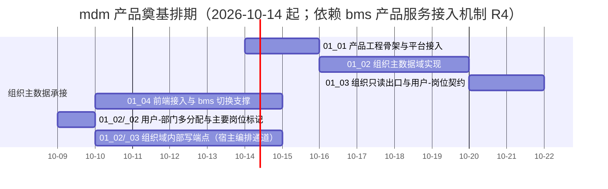

# mdm 产品奠基计划

> mdm 主数据管理 · 阶段一（mdm 产品奠基）排期计划：已完成 3 项，剩余 1 项（`01_02` 于 2026-10-09 **二次重开**：追加嵌套子任务 `02-02 用户-部门多分配与主要岗位标记`、未开工（16h）；**三次追加（2026-10-09）**：嵌套子任务 `02-03 组织域内部写端点（宿主编排通道）`（**32h，2026-10-10 ~ 2026-10-15，进行中**；供 bms 宿主编排以服务身份写入）；`02-02` 为 bms 阶段七 `02_01/_01` / `02_02/_01` 的**前置、先行实施**；前端切址（bms `11_02`）与 bms `org` 退役验收为跨仓收尾）

[文档首页](../../../文档首页.md) › mdm 产品奠基计划　|　[任务基线 →](../任务/01_组织主数据承接/01_组织主数据承接.md)　[需求基线 →](../需求/00_需求_mdm产品奠基.md)

## 1. 计划说明 

- **排期对象**：阶段一 4 条需求**已全部建任务基线**——需求域一 [组织主数据承接](../任务/01_组织主数据承接/01_组织主数据承接.md)（4 子任务）。
- **顺序口径**：工程骨架与平台接入（01_01）→ 组织主数据域实现（01_02）→ 组织只读出口与用户-岗位契约（01_03）→ 前端接入与 bms 切换支撑（01_04）。**mdm 先实现、bms 后退役**：bms 侧组织服务退役（bms 阶段二 需求域十一）随本阶段 `01_03` 交付后推进。
- **跨仓前置依赖（已解除）**：`01_01` 依赖 bms「产品服务接入机制」（R4.1 / R4.2 / R4.3 后端侧）与共享基座产品服务装配支持（需求域十二）——**2026-10-07 已全部交付**。另因 `org` 标识冲突（与 bms 现役 `org` 服务行四项重复），经拍板**先执行 bms `11_01` 退役释放 `org` 标识**再由 mdm 承接（同批次协同改动：条目易主 / 产品路由映射 / 库名前缀参数化 / 网关路由分组 / 装配同值去重），bms 侧已交付并推送。
- **排期口径**：`01_01` **已于 2026-10-07 提前完成**（原计划窗口 2026-10-14 ~ 10-15）；`01_02` **已于 2026-10-07 交付**（原计划窗口 2026-10-16 ~ 10-19）；`01_03` **已于 2026-10-07 交付**（原计划窗口 2026-10-20 ~ 10-22）；剩余 `01_04` 窗口见 §3。
- **跨仓前置（已解除）**：`01_02` 依赖 bms 需求 `12-4` / 任务 `12_04`（表归属产品注入与合并视图 + 服务包模型名前缀参数化 + org 业务码动作码种子 + 关联表主键口径回写）——**2026-10-07 已交付并推送**（bms 提交 `f77c326a7`）；mdm 侧 `bms-core` 依赖 ref 随之升级至该提交。
- **跨仓前置（已解除，`01_04`）**：`01_04` 的 mdm 前端工程依赖 bms 三条基座能力——`05-12` / `03_04`（跨仓模块产物接入与产品前端模块发布，R4.3）、`05-13` / `06_02`（模块请求能力产品寻址：产品模块经 `api.product(产品键, 域)` 取数）、`05-11` / `06_03`（具名插槽显式上下文注入通道：非路由承载宿主页的插件上下文）——**2026-10-08 全部交付并推送**（Kiwi `2258` / `2259` / `2260`）。
- **工时**：阶段合计 **148h**（01_01 16h + **01_02 52h（重估：+8h，含事件契约登记、幂等 / 限流、表归属注入消费、`bms-core` ref 升级与回归；再 +12h 含嵌套子任务 `02-01` 部门编码与岗位码可改：部门编码 + 迁移回填 + 岗位码放开 + 出口契约 + 前端原型 + 跨仓展示）** + **01_03 24h（重估：+8h，含跨仓平台用户只读出口契约联动、契约基线与 oasdiff 门禁、`user-roles` 缓存与失效代、数据范围 / 脱敏接线、组织域原型迁入；2026-10-07 已交付）** + **01_04 40h（重估：+32h，2026-10-08 范围扩容为含 mdm 前端工程全量——工程骨架与模块工程、部门 / 岗位管理页、三个具名插槽插件、契约类型包与零漂移门禁、前端 CI 作业、联调与原型对照）**）＋ **`02-02` 16h（已完成，2026-10-09）**（嵌套子任务：用户-部门多分配与主要岗位标记，2026-10-09 追加；为 bms 阶段七 `02_01/_01` / `02_02/_01` 的**前置、先行实施**）＋ **`02-03` 32h（嵌套子任务：组织域内部写端点／宿主编排通道，2026-10-09 三次追加；2026-10-09 详细设计定稿并拍板：内部 **4 个**写端点 + XA 分支参与方，**删除**基线快照与收敛版本口径；窗口 2026-10-10 ~ 2026-10-15，进行中）**。
- **里程碑锚点**：mdm 阶段一「组织主数据承接」——组织主数据域可用、组织只读出口与用户-岗位契约就绪、bms `org` 服务退役可切契约。
- **负责人**：minjian（兼职，单人）。

## 2. 已完成任务 

| 编号 | 任务 | 工时（重估） | 完成日期 | 任务文件 | 偏差与遗留 |
| --- | --- | --- | --- | --- | --- |
| 01_01 | mdm 产品工程骨架与平台接入 | 16h | 2026-10-07 | [01_01](../任务/01_组织主数据承接/01_组织主数据承接_01_mdm产品工程骨架与平台接入/01_组织主数据承接_01_mdm产品工程骨架与平台接入.md) | 标识冲突经拍板改走「bms 先退役释放 `org` → mdm 承接」（bms `11_01` 提前执行，跨仓协同）；遗留：服务包模型模块命名映射（**已随 bms `12_04` 解除**）、契约基线与 oasdiff 门禁（随 01_03）、网关联调端到端、镜像与三库集成 CI |
| 01_03 | 组织只读出口与用户-岗位契约 | 24h | 2026-10-07 | [01_03](../任务/01_组织主数据承接/01_组织主数据承接_03_组织只读出口与用户-岗位契约/01_组织主数据承接_03_组织只读出口与用户-岗位契约.md) | 交付：组织数据源 / 名称回显 / 用户来源三端口（自 bms `bms_core/org` 迁入并按 mdm 本地装配）+ 出口五端点（`/org/data-source/{users,posts,dept-tree}`、`/org/resolve-names`、`/org/user-roles`，与管面路径分离）+ 双通道鉴权 + 数据范围 / 脱敏强制接入 + `user-roles` 结果缓存与**租户级失效代** + `330101` 用户维度 fail-closed + 公开契约基线与破坏性变更门禁（`ops/contract_gate.py` + CI）+ 组织域原型按模块迁入 + 跨仓 bms `02_06`（平台用户只读出口内部契约）。**偏差与决策**：响应序列改 `{items:[...]}` 包装（基座集合类须契约标注）、数据范围条件形态按 `Iterable` 判定、业务失败统一 HTTP 200 + 统一响应 `code`、user-roles 部门链**精确匹配不含子树**、`sys_user.dept_id` 取数通道回退为不引入（登记为 bms `02_01` 跨仓依赖）；**已回写详设 §4.1 与任务文档**。遗留：前端类型与生成门禁（01_04）、前端切路径与 bms 11_02 一次性切换、`users` 部门过滤切平台字段（bms 02_01）、`OrgUser.avatar` 补全、生产 Redis 与多副本失效验证 |
| 01_04 | 前端接入与 bms 切换支撑（**含 mdm 前端工程全量**） | 40h | 2026-10-08 | [01_04](../任务/01_组织主数据承接/01_组织主数据承接_04_前端接入与bms切换支撑/01_组织主数据承接_04_前端接入与bms切换支撑.md) | **交付**：前端工作区（`frontend/`：模块工程 `@mdm/module-org` + 类型包 `@mdm/api-types`；跨仓基座包经 `file:` + 工作区成员）＋ `@mdm/api-types` 契约类型生成与**零漂移门禁**＋ `mdm-org` 运行时模块（`routes` 4 / `regions` 3 / `i18nPacks` 2：部门管理页、岗位管理页、两表单页；用户分配岗位 / 岗位分配 / 部门分配三插件）＋ 数据通路（组织域经**产品域寻址** `api.product('mdm','org')`，平台用户经平台通道）＋ 前端 CI 三作业（lint / test / build）+ 跨仓发布演练（平台侧 `publish --module-dir`，跨仓条目入册）。**门禁**：契约类型零漂移 / `tsc`+`vue-tsc` / lint / **34 例 + 4 例** / 构建（入口 14.3 KB gzip / 6 块 / 预算内）/ 产物面隔离零违规 / 独立预览构建 / 后端 93 例与契约门禁。**原型对照**：按原型补齐后**逐页对照通过**（页内编辑 / `ancestors` 链 / 关键字筛选 + 多选批量删除 + 绑定角色入口 / 弹窗分配（部门筛选、树多选精确匹配）+ 单条解绑）；截图存 `mdm/temp/prototype-check/`。**偏差与决策**：跨仓基座包须纳入工作区成员（实测）；产品契约类型包为**类型面依赖**（devDependency，进运行时依赖会被平台发布前强校验拒）；独立预览目标**不启用 MF**（框架依赖本地提供，修白屏）；契约标识请求面整数声明按字符串透传（精度）；Kiwi **2261**。**遗留**：① 真实网关 / 令牌 / 三库端到端与前端切址（随部署与 bms `11_02` 联合验收）；② 契约标识请求/响应口径统一（建议后端契约面修正）；③ 表单 / 字段 / 按钮元数据种子；④ 生产托管与「拉取 + 构建」编排；⑤ 说明项：关闭（宿主职责）、导出（平台能力）、系统信息子页签、表单页编辑态切换、岗位侧角色绑定写端点缺（mdm 契约仅只读 `posts/{id}/roles`） |

## 3. 剩余任务排期 

| 编号 | 任务 | 状态 | 工时 | 依赖 | 排期窗口 | 备注 | 偏差与遗留 |
| --- | --- | --- | --- | --- | --- | --- | --- |
| 01_02 | 组织主数据域实现（**2026-10-09 二次重开**：追加嵌套子任务 `02-02`；**三次追加** `02-03`） | 部分完成 | 52h ＋ 16h（`02-02`）＋ 32h（`02-03`） | 自有部分与 `_01` 已交付 | 2026-10-10 起 | 子任务 [`_02 用户-部门多分配与主要岗位标记`](../任务/01_组织主数据承接/01_组织主数据承接_02_组织主数据域实现/01_组织主数据承接_02_组织主数据域实现_02_用户-部门多分配与主要岗位标记/01_组织主数据承接_02_组织主数据域实现_02_用户-部门多分配与主要岗位标记.md) **已完成（2026-10-09）**（后端多分配与主要项 + 迁移 `0004` + 事件；前端四插件草稿化与 `registerSubmitter` 通道、`@mdm/api-types` 重生成、5 个服务层端点；Kiwi 2272 / 2273；为跨仓 bms `02_01/_01` / `02_02/_01` 前置，先行）；子任务 [`_03 组织域内部写端点（宿主编排通道）`](../任务/01_组织主数据承接/01_组织主数据承接_02_组织主数据域实现/01_组织主数据承接_02_组织主数据域实现_03_组织域内部写端点/01_组织主数据承接_02_组织主数据域实现_03_组织域内部写端点.md) **进行中（2026-10-10 ~ 2026-10-15，32h）**（供 bms 宿主编排以服务身份写入：**内部写通道 4 组**（服务身份白名单 + 幂等键 + 审计不放松）＋ **XA 分支参与方**（挂基座分支端点 + 登记四 `op`，只调已有服务层）；~~基线读取 / 收敛版本~~ **2026-10-09 拍板删除**（强一致专项已就绪，属废路径）） | 原 `01_03` 遗留「`users` 部门过滤切平台字段（bms `02_01`）」**已注销**（`sys_user.dept_id` 通道不引入） |

## 4. 排期甘特图 

## 5. 阶段一验收门禁 

| 验收点 | 对应任务 | 达成路径（结论与证据索引） |
| --- | --- | --- |
| mdm 服务可启动、经网关可达、服务目录登记通过 | 01_01 | **已达成（2026-10-07）**：① **可启动**——`/healthz` `/readyz` 均 200 且响应服务身份 `org`（启动 / 探针用例，ASGI 真跑）；② **服务目录登记校验通过**——`ops.check_modules` 通过（清单唯一与格式 + 产品维度四条断言 + **两侧同值**（平台侧 16 行对账）+ 服务包声明），装配期经基座产品维度 fail-closed 校验；③ **经网关可达**为**生成件证明**——平台侧 `PRODUCT_ROUTES` 登记 `mdm/org → org`（对外 `/api/mdm/v1/org/...`）、网关 upstream `org:8000` 与 Compose 服务名对齐；端到端联调随部署任务。证据见[测试记录](../任务/01_组织主数据承接/01_组织主数据承接_01_mdm产品工程骨架与平台接入/测试/01_测试_01_mdm产品工程骨架与平台接入.md)（39 用例 / 覆盖率 82.84% / ruff / pyright / 清单 / 契约零漂移全绿） |
| 组织主数据域 CRUD 与部门树可用、校验与审计生效 | 01_02 | **已达成（2026-10-07）**：① **五表落库与迁移**——`org_dept` / `org_post` / `org_user_post` / `org_role_post` / `org_role_dept` 模型 + `org:tenant` 链 `0001_org_tables`（业务五表）/ `0002_outbox_tables`（基础设施三表），迁移升到 head 后库结构与链元数据**零漂移**，降级往返通过；② **部门树**——新建（`ancestors` 路径）/ 移动（防环 + 同事务级联更新子树）/ 删除引用检查（子部门 / 岗位 / 角色分配，逐项错误码 330054 / 330055 / 330056）；③ **岗位**——CRUD / 编码唯一与格式（`org.post_code_pattern`）/ 归属部门校验 / 删除引用（330034 / 330035）；④ **分配**——用户-岗位 / 角色-岗位 / 角色-部门全量覆盖（diff 后增删单事务）+ 解绑 + 用户删除清理（幂等）；⑤ **审计**——写操作经基座 `AuditCapturer` 占位 + 结构化操作日志（真实字段级审计随审计阶段）；⑥ **事件**——5 条 `org.*` 契约登记且快照零漂移，事件经事务性发件箱同事务写入（契约 enforce 放行）；⑦ **门禁**——pytest 64 例 / 覆盖率 **85.99%**（门槛 70%）/ ruff + format / pyright（strict 0 err）/ `ops.check_modules` / `ops.contract_snapshot check`（19 个管理面端点 + 探针）/ `ops.event_contracts check` 全绿。证据见[测试记录](../任务/01_组织主数据承接/01_组织主数据承接_02_组织主数据域实现/测试/01_测试_02_组织主数据域实现.md) |
| 组织只读出口真实取数、用户-岗位与按用户解析角色契约可用、事件发布 | 01_03 | **已达成（2026-10-07）**：① **出口五端点**——`/api/v1/org/data-source/{users,posts,dept-tree}` + `/api/v1/org/resolve-names` + `/api/v1/org/user-roles`（与 01_02 管理面路径分离），公开契约快照与基线一致；② **真实取数**——部门树一次性（嵌套 `children`）/ 岗位分页筛选（部门含子级）/ 用户经平台内部契约取数（**不跨库读 `sys_user`**，不可达即 `330101` fail-closed）/ 名称批量回显（三类目标、未命中占位、单批 `IN` 无 N+1）；③ **按用户解析角色**——岗位链 ∪ 部门链（精确匹配）并集去重保序 + 结果短时缓存与**租户级失效代**（写侧推进）；④ **鉴权与数据边界**——双通道鉴权（登录态 + 服务身份白名单）、数据范围与脱敏依赖**强制接入**（出口无旁路端点）；⑤ **事件**——5 条 `org.*` 契约快照零漂移且兼容（`ops.event_contracts check` 通过；消费方联调随 bms 11_02 / 阶段七）；⑥ **门禁**——pytest 93 例 / 覆盖率 **89.36%**（门槛 70%）/ ruff + format / pyright（strict 0 err）/ `ops.check_modules` / `ops.contract_snapshot check` / `ops.event_contracts check` / **`ops.contract_gate check`**（基线与破坏性变更门禁，已入 CI）全绿。证据见[测试记录](../任务/01_组织主数据承接/01_组织主数据承接_03_组织只读出口与用户-岗位契约/测试/01_测试_03_组织只读出口与用户-岗位契约.md) |
| 前端组织选择经 mdm 出口联通、bms `org` 服务退役验收通过 | 01_04 | **前端部分已达成（2026-10-08）**：① **可接入产物**——`mdm-org` 模块经独立构建产出远端产物（入口闭包 14.3 KB gzip / 6 块 / sourcemap 就位 / 元数据版本一致）并经平台侧 `publish --module-dir` 发布演练通过（§3 01_04 行；跨仓条目入册）；② **契约与类型**——`@mdm/api-types` 自产品契约快照生成、零漂移门禁入 CI，另有**契约对齐门禁**（前端调用面 ⊆ 契约、查询参数名合法、契约管理面端点全覆盖）与后端 93 例回归；③ **界面**——管理页与三插件经**可交互原型逐页对照通过**（实现页与原型页截图对照，测试记录 §4）。**待联合验收**：前端组织选择字段经 mdm 出口的**真实联通**（查询 / 批量回显 / 部门树一次性返回）与 bms `org` 服务退役验收——改址归 bms `11_02`（跨仓联合），随部署联调（真实网关 / 令牌 / 三库）。 |

## 6. 风险与对策 

| 风险 | 影响 | 概率 | 缓解措施 |
| --- | --- | --- | --- |
| mdm 从零奠基，工程 / CI / 部署新建面大 | 中 | 高 | 平台能力（认证 / 权限 / 审计 / 事件 / 文件 / 字典）一律复用 bms，只建主数据域；组织域单域先落，其余域按需接入 |
| mdm 出口未就绪阻塞 bms 退役 | 中 | 中 | 顺序固定「mdm 先、bms 后」；bms 退役任务窗口排于 mdm `01_03` 之后（见 bms 阶段二计划） |
| 契约迁出（`bms_core/org` → mdm）影响面未清 | 中 | 中 | 退役前逐项核对 bms 侧调用点（`assembly` / `deps` / 前端出口），以预检零漂移闭环 |

> 本文档按 bms《[文档生成规范](../../../../bms文档/规范/文档生成规范.md)》与《[计划文档规范](../../../../bms文档/规范/计划文档规范.md)》编写
